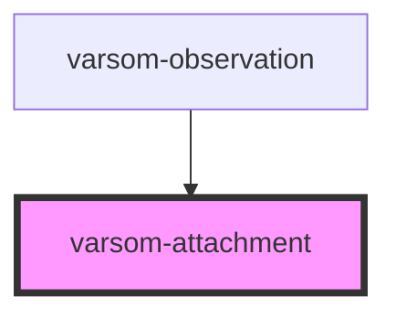

# varsom-attachment

<!-- Auto Generated Below -->

## Properties

| Property           | Attribute           | Description | Type  | Default     |
| ------------------ | ------------------- | ----------- | ----- | ----------- |
| `comment`          | `comment`           |             | `any` | `undefined` |
| `copyright`        | `copyright`         |             | `any` | `undefined` |
| `imageUrl`         | `image-url`         |             | `any` | `undefined` |
| `photographer`     | `photographer`      |             | `any` | `undefined` |
| `registrationName` | `registration-name` |             | `any` | `undefined` |
| `strings`          | `strings`           |             | `any` | `undefined` |

## Dependencies

### Used by

 - [varsom-observation](../varsom-observasjon)

### Graph

----------------------------------------------

*Built with [StencilJS](https://stenciljs.com/)*
