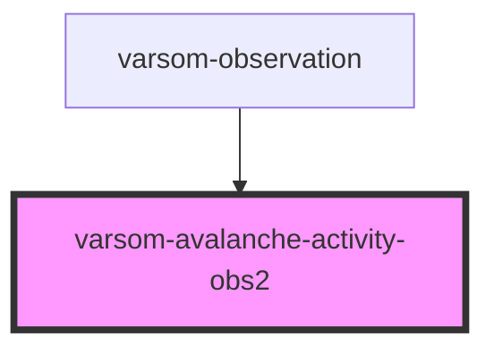

# varsom-avalanche-activity-obs2

<!-- Auto Generated Below -->

## Properties

| Property        | Attribute         | Description | Type  | Default     |
| --------------- | ----------------- | ----------- | ----- | ----------- |
| `avalCauseName` | `aval-cause-name` |             | `any` | `undefined` |
| `comment`       | `comment`         |             | `any` | `undefined` |
| `dtStart`       | `dt-start`        |             | `any` | `undefined` |
| `strings`       | `strings`         |             | `any` | `undefined` |

## Dependencies

### Used by

 - [varsom-observation](../varsom-observasjon)

### Graph

----------------------------------------------

*Built with [StencilJS](https://stenciljs.com/)*
