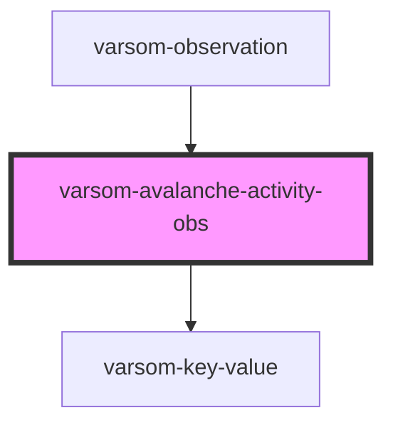

# varsom-avalanche-activity-obs2

<!-- Auto Generated Below -->

## Properties

| Property                 | Attribute                    | Description | Type  | Default     |
| ------------------------ | ---------------------------- | ----------- | ----- | ----------- |
| `Aspect`                 | `aspect`                     |             | `any` | `undefined` |
| `AvalancheActivityObsID` | `avalanche-activity-obs-i-d` |             | `any` | `undefined` |
| `AvalancheName`          | `avalanche-name`             |             | `any` | `undefined` |
| `AvalancheTID`           | `avalanche-t-i-d`            |             | `any` | `undefined` |
| `AvalancheTriggerName`   | `avalanche-trigger-name`     |             | `any` | `undefined` |
| `AvalancheTriggerTID`    | `avalanche-trigger-t-i-d`    |             | `any` | `undefined` |
| `Comment`                | `comment`                    |             | `any` | `undefined` |
| `DestructiveSizeName`    | `destructive-size-name`      |             | `any` | `undefined` |
| `DestructiveSizeTID`     | `destructive-size-t-i-d`     |             | `any` | `undefined` |
| `DtAvalancheTime`        | `dt-avalanche-time`          |             | `any` | `undefined` |
| `DtOffAvalancheTime`     | `dt-off-avalanche-time`      |             | `any` | `undefined` |
| `EstimatedNumName`       | `estimated-num-name`         |             | `any` | `undefined` |
| `EstimatedNumTID`        | `estimated-num-t-i-d`        |             | `any` | `undefined` |
| `HeigthStartZone`        | `heigth-start-zone`          |             | `any` | `undefined` |
| `SnowLine`               | `snow-line`                  |             | `any` | `undefined` |
| `SnowLineName`           | `snow-line-name`             |             | `any` | `undefined` |
| `TerrainStartZoneName`   | `terrain-start-zone-name`    |             | `any` | `undefined` |
| `TerrainStartZoneTID`    | `terrain-start-zone-t-i-d`   |             | `any` | `undefined` |
| `header`                 | `header`                     |             | `any` | `undefined` |
| `strings`                | `strings`                    |             | `any` | `undefined` |

## Dependencies

### Used by

 - [varsom-observation](../varsom-observasjon)

### Depends on

- [varsom-key-value](../varsom-key-value)

### Graph

----------------------------------------------

*Built with [StencilJS](https://stenciljs.com/)*
