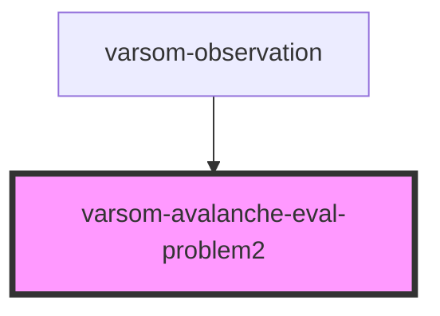

# varsom-avalanche-eval-problem2

<!-- Auto Generated Below -->

## Properties

| Property                     | Attribute                        | Description | Type  | Default     |
| ---------------------------- | -------------------------------- | ----------- | ----- | ----------- |
| `avalCauseAttributeSoftName` | `aval-cause-attribute-soft-name` |             | `any` | `undefined` |
| `avalCauseDepthName`         | `aval-cause-depth-name`          |             | `any` | `undefined` |
| `avalCauseName`              | `aval-cause-name`                |             | `any` | `undefined` |
| `avalPropagationName`        | `aval-propagation-name`          |             | `any` | `undefined` |
| `avalTriggerSimpleName`      | `aval-trigger-simple-name`       |             | `any` | `undefined` |
| `avalancheExtName`           | `avalanche-ext-name`             |             | `any` | `undefined` |
| `destructiveSizeName`        | `destructive-size-name`          |             | `any` | `undefined` |
| `strings`                    | `strings`                        |             | `any` | `undefined` |

## Dependencies

### Used by

 - [varsom-observation](../varsom-observasjon)

### Graph

----------------------------------------------

*Built with [StencilJS](https://stenciljs.com/)*
