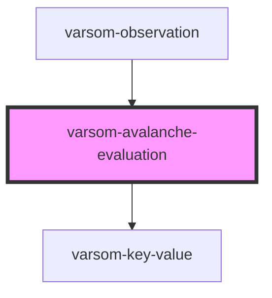

# varsom-avalanche-eval-problem2

<!-- Auto Generated Below -->

## Properties

| Property                | Attribute                   | Description | Type           | Default     |
| ----------------------- | --------------------------- | ----------- | -------------- | ----------- |
| `Attachments`           | --                          |             | `Attachment[]` | `undefined` |
| `AvalancheDangerName`   | `avalanche-danger-name`     |             | `any`          | `undefined` |
| `AvalancheDangerTID`    | `avalanche-danger-t-i-d`    |             | `any`          | `undefined` |
| `AvalancheEvaluation1`  | `avalanche-evaluation-1`    |             | `any`          | `undefined` |
| `AvalancheProblemName1` | `avalanche-problem-name-1`  |             | `any`          | `undefined` |
| `AvalancheProblemName2` | `avalanche-problem-name-2`  |             | `any`          | `undefined` |
| `AvalancheProblemName3` | `avalanche-problem-name-3`  |             | `any`          | `undefined` |
| `AvalancheProblemTID1`  | `avalanche-problem-t-i-d-1` |             | `any`          | `undefined` |
| `AvalancheProblemTID2`  | `avalanche-problem-t-i-d-2` |             | `any`          | `undefined` |
| `AvalancheProblemTID3`  | `avalanche-problem-t-i-d-3` |             | `any`          | `undefined` |
| `CanPublish`            | `can-publish`               |             | `any`          | `undefined` |
| `Comment`               | `comment`                   |             | `any`          | `undefined` |
| `RegID`                 | `reg-i-d`                   |             | `any`          | `undefined` |
| `ValidExposition`       | `valid-exposition`          |             | `any`          | `undefined` |
| `ValidHeightFrom`       | `valid-height-from`         |             | `any`          | `undefined` |
| `ValidHeightRelative`   | `valid-height-relative`     |             | `any`          | `undefined` |
| `ValidHeigtTo`          | `valid-heigt-to`            |             | `any`          | `undefined` |
| `strings`               | `strings`                   |             | `any`          | `undefined` |

## Dependencies

### Used by

 - [varsom-observation](../varsom-observasjon)

### Depends on

- [varsom-key-value](../varsom-key-value)

### Graph

----------------------------------------------

*Built with [StencilJS](https://stenciljs.com/)*
