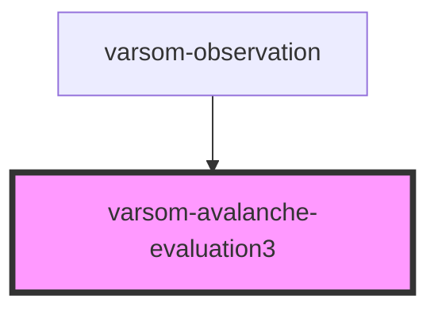

# varsom-avalanche-evaluation3

<!-- Auto Generated Below -->

## Properties

| Property               | Attribute               | Description | Type  | Default     |
| ---------------------- | ----------------------- | ----------- | ----- | ----------- |
| `avalancheDevelopment` | `avalanche-development` |             | `any` | `undefined` |
| `avalancheEvaluation`  | `avalanche-evaluation`  |             | `any` | `undefined` |
| `comment`              | `comment`               |             | `any` | `undefined` |
| `strings`              | `strings`               |             | `any` | `undefined` |

## Dependencies

### Used by

 - [varsom-observation](../varsom-observasjon)

### Graph

----------------------------------------------

*Built with [StencilJS](https://stenciljs.com/)*
