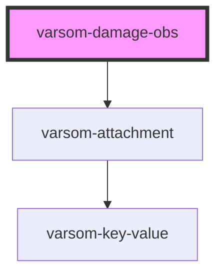

# varsom-damage-obs

<!-- Auto Generated Below -->

## Properties

| Property         | Attribute           | Description | Type     | Default     |
| ---------------- | ------------------- | ----------- | -------- | ----------- |
| `Attachments`    | --                  |             | `any[]`  | `undefined` |
| `comment`        | `comment`           |             | `string` | `undefined` |
| `damagePosition` | `damage-position`   |             | `any`    | `undefined` |
| `damageTypeName` | `damage-type-name`  |             | `string` | `undefined` |
| `damageTypeTID`  | `damage-type-t-i-d` |             | `number` | `undefined` |
| `geoHazardName`  | `geo-hazard-name`   |             | `string` | `undefined` |
| `geoHazardTID`   | `geo-hazard-t-i-d`  |             | `number` | `undefined` |
| `strings`        | `strings`           |             | `any`    | `undefined` |

## Dependencies

### Depends on

- [varsom-attachment](../varsom-attachment)

### Graph

----------------------------------------------

*Built with [StencilJS](https://stenciljs.com/)*
