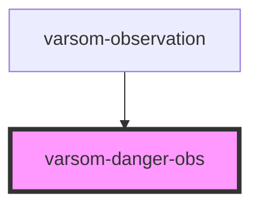

# varsom-danger-obs

<!-- Auto Generated Below -->

## Properties

| Property         | Attribute          | Description | Type  | Default     |
| ---------------- | ------------------ | ----------- | ----- | ----------- |
| `comment`        | `comment`          |             | `any` | `undefined` |
| `dangerSignName` | `danger-sign-name` |             | `any` | `undefined` |
| `strings`        | `strings`          |             | `any` | `undefined` |

## Dependencies

### Used by

 - [varsom-observation](../varsom-observasjon)

### Graph

----------------------------------------------

*Built with [StencilJS](https://stenciljs.com/)*
