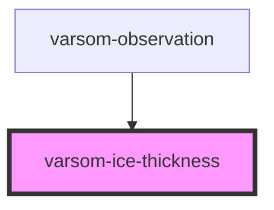

# varsom-ice-thickness

<!-- Auto Generated Below -->

## Properties

| Property             | Attribute           | Description | Type                  | Default     |
| -------------------- | ------------------- | ----------- | --------------------- | ----------- |
| `Comment`            | `comment`           |             | `any`                 | `undefined` |
| `IceHeightAfter`     | `ice-height-after`  |             | `any`                 | `undefined` |
| `IceHeightBefore`    | `ice-height-before` |             | `any`                 | `undefined` |
| `IceThicknessLayers` | --                  |             | `IceThicknessLayer[]` | `undefined` |
| `IceThicknessSum`    | `ice-thickness-sum` |             | `any`                 | `undefined` |
| `SlushSnow`          | `slush-snow`        |             | `any`                 | `undefined` |
| `SnowDepth`          | `snow-depth`        |             | `any`                 | `undefined` |
| `strings`            | `strings`           |             | `any`                 | `undefined` |

## Dependencies

### Used by

 - [varsom-observation](../varsom-observasjon)

### Graph

----------------------------------------------

*Built with [StencilJS](https://stenciljs.com/)*
