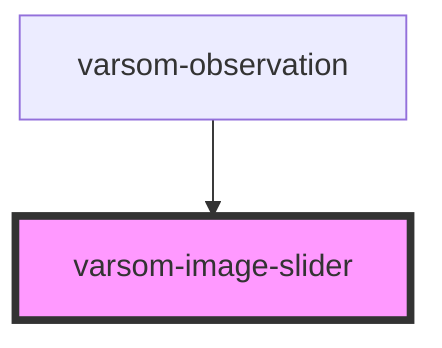

# varsom-attachment

<!-- Auto Generated Below -->

## Properties

| Property       | Attribute       | Description | Type     | Default     |
| -------------- | --------------- | ----------- | -------- | ----------- |
| `_images`      | --              |             | `any[]`  | `undefined` |
| `shortVersion` | `short-version` |             | `string` | `undefined` |
| `strings`      | `strings`       |             | `any`    | `undefined` |

## Dependencies

### Used by

 - [varsom-observation](../varsom-observasjon)

### Graph

----------------------------------------------

*Built with [StencilJS](https://stenciljs.com/)*
