# varsom-avalanche-eval-problem

<!-- Auto Generated Below -->

## Properties

| Property | Attribute | Description | Type  | Default     |
| -------- | --------- | ----------- | ----- | ----------- |
| `_key`   | `_key`    |             | `any` | `undefined` |
| `_value` | `_value`  |             | `any` | `undefined` |

## Dependencies

### Used by

 - [varsom-attachment](../varsom-attachment)
 - [varsom-avalanche-activity-obs](../varsom-avalanche-activity-obs)
 - [varsom-avalanche-activity-obs2](../varsom-avalanche-activity-obs2)
 - [varsom-avalanche-eval-problem](../varsom-avalanche-eval-problem)
 - [varsom-avalanche-eval-problem2](../varsom-avalanche-eval-problem2)
 - [varsom-avalanche-evaluation](../varsom-avalanche-evaluation)
 - [varsom-avalanche-evaluation2](../varsom-avalanche-evaluation2)
 - [varsom-avalanche-evaluation3](../varsom-avalanche-evaluation3)
 - [varsom-avalanche-obs](../varsom-avalanche-obs)
 - [varsom-compression-test](../varsom-compression-test)
 - [varsom-danger-obs](../varsom-danger-obs)
 - [varsom-ice-cover-observation](../varsom-ice-cover-observation)

### Graph

```mermaid
graph TD;
  varsom-attachment --> varsom-key-value
  varsom-avalanche-activity-obs --> varsom-key-value
  varsom-avalanche-activity-obs2 --> varsom-key-value
  varsom-avalanche-eval-problem --> varsom-key-value
  varsom-avalanche-eval-problem2 --> varsom-key-value
  varsom-avalanche-evaluation --> varsom-key-value
  varsom-avalanche-evaluation2 --> varsom-key-value
  varsom-avalanche-evaluation3 --> varsom-key-value
  varsom-avalanche-obs --> varsom-key-value
  varsom-compression-test --> varsom-key-value
  varsom-danger-obs --> varsom-key-value
  varsom-ice-cover-observation --> varsom-key-value
  style varsom-key-value fill:#f9f,stroke:#333,stroke-width:4px
```

----------------------------------------------

*Built with [StencilJS](https://stenciljs.com/)*
