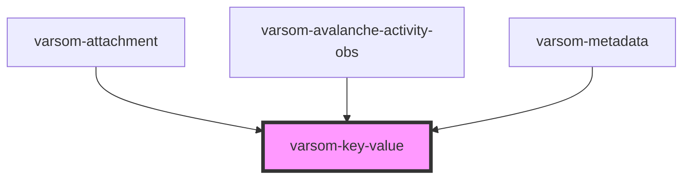

# varsom-avalanche-eval-problem2

<!-- Auto Generated Below -->

## Properties

| Property | Attribute | Description | Type     | Default     |
| -------- | --------- | ----------- | -------- | ----------- |
| `_value` | `_value`  |             | `any`    | `undefined` |
| `dt`     | `dt`      |             | `string` | `undefined` |
| `dty`    | `dty`     |             | `string` | `undefined` |
| `label`  | `label`   |             | `any`    | `undefined` |

## Dependencies

### Used by

 - [varsom-attachment](../varsom-attachment)
 - [varsom-avalanche-activity-obs](../varsom-avalanche-activity-obs)
 - [varsom-metadata](../varsom-metadata)

### Graph

----------------------------------------------

*Built with [StencilJS](https://stenciljs.com/)*
