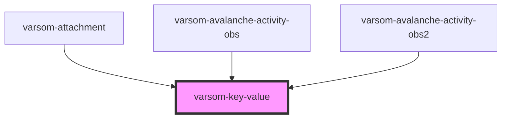

# varsom-avalanche-eval-problem

<!-- Auto Generated Below -->

## Properties

| Property | Attribute | Description | Type  | Default     |
| -------- | --------- | ----------- | ----- | ----------- |
| `_key`   | `_key`    |             | `any` | `undefined` |
| `_value` | `_value`  |             | `any` | `undefined` |

## Dependencies

### Used by

 - [varsom-attachment](../varsom-attachment)
 - [varsom-avalanche-activity-obs](../varsom-avalanche-activity-obs)
 - [varsom-avalanche-activity-obs2](../varsom-avalanche-activity-obs2)

### Graph

----------------------------------------------

*Built with [StencilJS](https://stenciljs.com/)*
