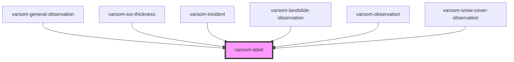

# varsom-avalanche-eval-problem

<!-- Auto Generated Below -->

## Properties

| Property | Attribute | Description | Type  | Default     |
| -------- | --------- | ----------- | ----- | ----------- |
| `label`  | `label`   |             | `any` | `undefined` |

## Dependencies

### Used by

 - [varsom-general-observation](../varsom-general-observation)
 - [varsom-ice-thickness](../varsom-ice-thickness)
 - [varsom-incident](../varsom-incident)
 - [varsom-landslide-observation](../varsom-landslide-observation)
 - [varsom-observation](../varsom-observasjon)
 - [varsom-snow-cover-observation](../varsom-snow-cover-observation)

### Graph

----------------------------------------------

*Built with [StencilJS](https://stenciljs.com/)*
