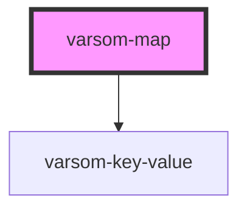

# varsom-attachment

<!-- Auto Generated Below -->

## Properties

| Property             | Attribute              | Description | Type      | Default     |
| -------------------- | ---------------------- | ----------- | --------- | ----------- |
| `Aspect`             | `aspect`               |             | `any`     | `undefined` |
| `AttachmentId`       | `attachment-id`        |             | `any`     | `undefined` |
| `AttachmentMimeType` | `attachment-mime-type` |             | `any`     | `undefined` |
| `Comment`            | `comment`              |             | `any`     | `undefined` |
| `Copyright`          | `copyright`            |             | `any`     | `undefined` |
| `CropImage`          | `crop-image`           |             | `boolean` | `undefined` |
| `GeoHazardName`      | `geo-hazard-name`      |             | `any`     | `undefined` |
| `GeoHazardTID`       | `geo-hazard-t-i-d`     |             | `any`     | `undefined` |
| `IsMainAttachment`   | `is-main-attachment`   |             | `any`     | `undefined` |
| `Photographer`       | `photographer`         |             | `any`     | `undefined` |
| `RegistrationName`   | `registration-name`    |             | `any`     | `undefined` |
| `RegistrationTID`    | `registration-t-i-d`   |             | `any`     | `undefined` |
| `Url`                | `url`                  |             | `any`     | `undefined` |
| `shortVersion`       | `short-version`        |             | `any`     | `undefined` |
| `strings`            | `strings`              |             | `any`     | `undefined` |

## Dependencies

### Depends on

- [varsom-key-value](../varsom-key-value)

### Graph

----------------------------------------------

*Built with [StencilJS](https://stenciljs.com/)*
