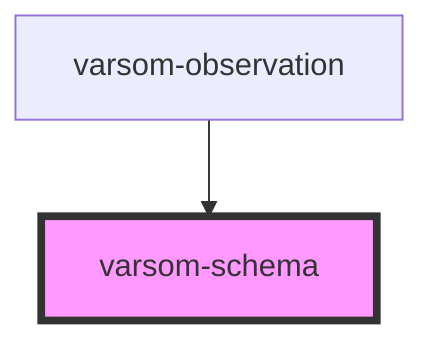

# varsom-observation

<!-- Auto Generated Below -->

## Properties

| Property                   | Attribute                    | Description | Type  | Default     |
| -------------------------- | ---------------------------- | ----------- | ----- | ----------- |
| `airTemperature`           | `air-temperature`            |             | `any` | `undefined` |
| `avalCauseName`            | `aval-cause-name`            |             | `any` | `undefined` |
| `comment`                  | `comment`                    |             | `any` | `undefined` |
| `copyright`                | `copyright`                  |             | `any` | `undefined` |
| `dtAvalancheTime`          | `dt-avalanche-time`          |             | `any` | `undefined` |
| `dtMeasurementTime`        | `dt-measurement-time`        |             | `any` | `undefined` |
| `dtStart`                  | `dt-start`                   |             | `any` | `undefined` |
| `measurementReferenceName` | `measurement-reference-name` |             | `any` | `undefined` |
| `measurementTypeName`      | `measurement-type-name`      |             | `any` | `undefined` |
| `observationTimingName`    | `observation-timing-name`    |             | `any` | `undefined` |
| `observer`                 | `observer`                   |             | `any` | `undefined` |
| `photographer`             | `photographer`               |             | `any` | `undefined` |
| `registrationName`         | `registration-name`          |             | `any` | `undefined` |
| `strings`                  | `strings`                    |             | `any` | `undefined` |
| `waterAstrayName`          | `water-astray-name`          |             | `any` | `undefined` |
| `waterLevel`               | `water-level`                |             | `any` | `undefined` |
| `waterLevelStateName`      | `water-level-state-name`     |             | `any` | `undefined` |
| `waterLevelValue`          | `water-level-value`          |             | `any` | `undefined` |
| `weatherPrecipitationName` | `weather-precipitation-name` |             | `any` | `undefined` |

## Dependencies

### Used by

 - [varsom-observation](.)

### Graph

----------------------------------------------

*Built with [StencilJS](https://stenciljs.com/)*
