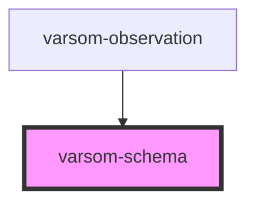

# varsom-observation

<!-- Auto Generated Below -->

## Properties

| Property           | Attribute           | Description | Type     | Default     |
| ------------------ | ------------------- | ----------- | -------- | ----------- |
| `comment`          | `comment`           |             | `string` | `undefined` |
| `copyright`        | `copyright`         |             | `string` | `undefined` |
| `label`            | `label`             |             | `string` | `undefined` |
| `observer`         | `observer`          |             | `string` | `undefined` |
| `photographer`     | `photographer`      |             | `string` | `undefined` |
| `registrationName` | `registration-name` |             | `string` | `undefined` |

## Dependencies

### Used by

 - [varsom-observation](.)

### Graph

----------------------------------------------

*Built with [StencilJS](https://stenciljs.com/)*
