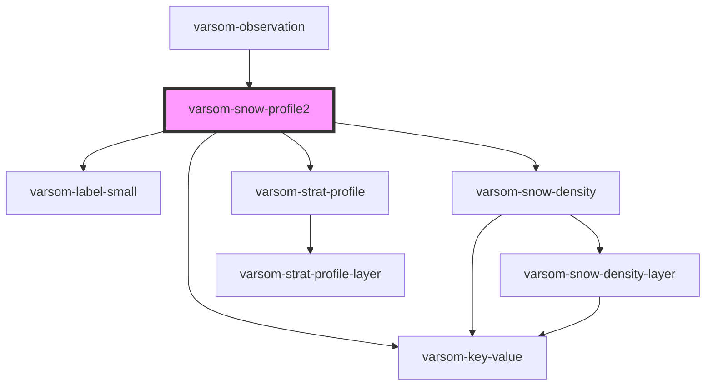

# varsom-snow-surface

<!-- Auto Generated Below -->

## Properties

| Property            | Attribute              | Description | Type            | Default     |
| ------------------- | ---------------------- | ----------- | --------------- | ----------- |
| `Comment`           | `comment`              |             | `any`           | `undefined` |
| `Exposition`        | `exposition`           |             | `any`           | `undefined` |
| `IsProfileToGround` | `is-profile-to-ground` |             | `any`           | `undefined` |
| `SlopeAngle`        | `slope-angle`          |             | `any`           | `undefined` |
| `SnowDensity`       | --                     |             | `SnowDensity[]` | `undefined` |
| `SnowTemp`          | `snow-temp`            |             | `any`           | `undefined` |
| `StratProfile`      | `strat-profile`        |             | `any`           | `undefined` |
| `TotalDepth`        | `total-depth`          |             | `any`           | `undefined` |
| `strings`           | `strings`              |             | `any`           | `undefined` |

## Dependencies

### Used by

 - [varsom-observation](../varsom-observasjon)

### Depends on

- [varsom-label-small](../varsom-label-small)
- [varsom-key-value](../varsom-key-value)
- [varsom-snow-density](../varsom-snow-density)
- [varsom-strat-profile](../varsom-strat-profile)

### Graph

----------------------------------------------

*Built with [StencilJS](https://stenciljs.com/)*
