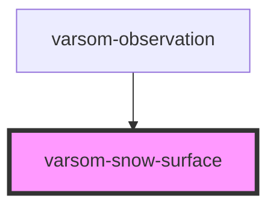

# varsom-snow-surface

<!-- Auto Generated Below -->

## Properties

| Property                  | Attribute                    | Description | Type  | Default     |
| ------------------------- | ---------------------------- | ----------- | ----- | ----------- |
| `comment`                 | `comment`                    |             | `any` | `undefined` |
| `newSnowLine`             | `new-snow-line`              |             | `any` | `undefined` |
| `skiConditionsName`       | `ski-conditions-name`        |             | `any` | `undefined` |
| `snowDepth`               | `snow-depth`                 |             | `any` | `undefined` |
| `snowDriftName`           | `snow-drift-name`            |             | `any` | `undefined` |
| `snowSurfaceName`         | `snow-surface-name`          |             | `any` | `undefined` |
| `strings`                 | `strings`                    |             | `any` | `undefined` |
| `surfaceWaterContentName` | `surface-water-content-name` |             | `any` | `undefined` |

## Dependencies

### Used by

 - [varsom-observation](../varsom-observasjon)

### Graph

----------------------------------------------

*Built with [StencilJS](https://stenciljs.com/)*
