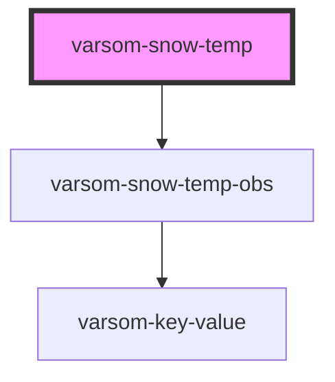

# varsom-metadata

<!-- Auto Generated Below -->

## Properties

| Property  | Attribute | Description | Type            | Default     |
| --------- | --------- | ----------- | --------------- | ----------- |
| `Layers`  | --        |             | `SnowTempObs[]` | `undefined` |
| `strings` | `strings` |             | `any`           | `undefined` |

## Dependencies

### Depends on

- [varsom-snow-temp-obs](../varsom-snow-temp-obs)

### Graph

----------------------------------------------

*Built with [StencilJS](https://stenciljs.com/)*
