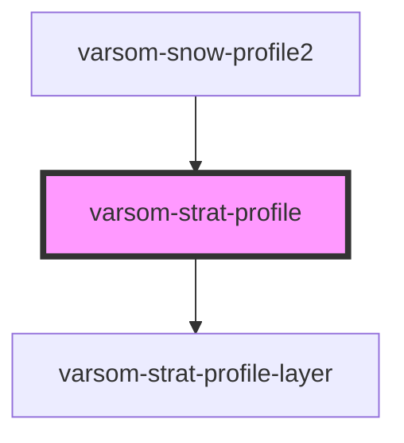

# varsom-snow-surface

<!-- Auto Generated Below -->

## Properties

| Property     | Attribute     | Description | Type                  | Default     |
| ------------ | ------------- | ----------- | --------------------- | ----------- |
| `Layers`     | --            |             | `StratProfileLayer[]` | `undefined` |
| `TotalDepth` | `total-depth` |             | `any`                 | `undefined` |
| `strings`    | `strings`     |             | `any`                 | `undefined` |

## Dependencies

### Used by

 - [varsom-snow-profile2](../varsom-snow-profile2)

### Depends on

- [varsom-strat-profile-layer](../varsom-strat-profile-layer)

### Graph

----------------------------------------------

*Built with [StencilJS](https://stenciljs.com/)*
