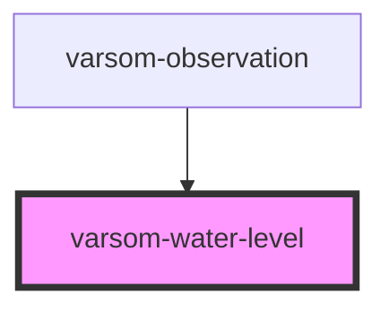

# varsom-water-level2

<!-- Auto Generated Below -->

## Properties

| Property              | Attribute               | Description | Type  | Default     |
| --------------------- | ----------------------- | ----------- | ----- | ----------- |
| `IsRiver`             | `is-river`              |             | `any` | `undefined` |
| `MeasuredDischarge`   | `measured-discharge`    |             | `any` | `undefined` |
| `WaterLevelDescribed` | `water-level-described` |             | `any` | `undefined` |
| `WaterLevelRefName`   | `water-level-ref-name`  |             | `any` | `undefined` |
| `WaterLevelRefTID`    | `water-level-ref-t-i-d` |             | `any` | `undefined` |
| `WaterLevelValue`     | `water-level-value`     |             | `any` | `undefined` |
| `strings`             | `strings`               |             | `any` | `undefined` |

## Dependencies

### Used by

 - [varsom-observation](../varsom-observasjon)

### Graph

----------------------------------------------

*Built with [StencilJS](https://stenciljs.com/)*
