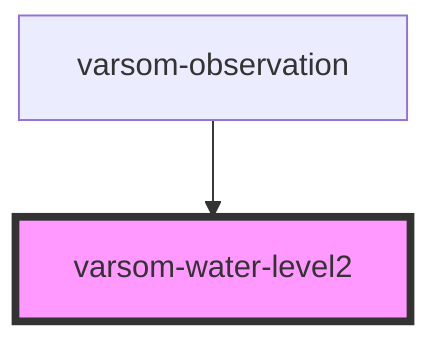

# varsom-water-level2

<!-- Auto Generated Below -->

## Properties

| Property                   | Attribute                    | Description | Type  | Default     |
| -------------------------- | ---------------------------- | ----------- | ----- | ----------- |
| `comment`                  | `comment`                    |             | `any` | `undefined` |
| `measurementReferenceName` | `measurement-reference-name` |             | `any` | `undefined` |
| `measurementTypeName`      | `measurement-type-name`      |             | `any` | `undefined` |
| `observationTimingName`    | `observation-timing-name`    |             | `any` | `undefined` |
| `strings`                  | `strings`                    |             | `any` | `undefined` |
| `waterAstrayName`          | `water-astray-name`          |             | `any` | `undefined` |

## Dependencies

### Used by

 - [varsom-observation](../varsom-observasjon)

### Graph

----------------------------------------------

*Built with [StencilJS](https://stenciljs.com/)*
