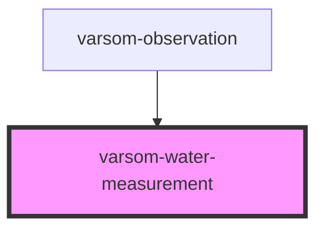

# varsom-water-measurement

<!-- Auto Generated Below -->

## Properties

| Property            | Attribute             | Description | Type  | Default     |
| ------------------- | --------------------- | ----------- | ----- | ----------- |
| `comment`           | `comment`             |             | `any` | `undefined` |
| `dtMeasurementTime` | `dt-measurement-time` |             | `any` | `undefined` |
| `strings`           | `strings`             |             | `any` | `undefined` |
| `waterLevelValue`   | `water-level-value`   |             | `any` | `undefined` |

## Dependencies

### Used by

 - [varsom-observation](../varsom-observasjon)

### Graph

----------------------------------------------

*Built with [StencilJS](https://stenciljs.com/)*
