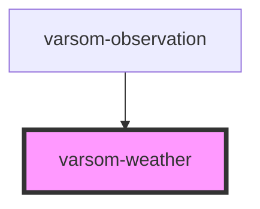

# varsom-weather

<!-- Auto Generated Below -->

## Properties

| Property                   | Attribute                    | Description | Type  | Default     |
| -------------------------- | ---------------------------- | ----------- | ----- | ----------- |
| `airTemperature`           | `air-temperature`            |             | `any` | `undefined` |
| `strings`                  | `strings`                    |             | `any` | `undefined` |
| `weatherPrecipitationName` | `weather-precipitation-name` |             | `any` | `undefined` |

## Dependencies

### Used by

 - [varsom-observation](../varsom-observasjon)

### Graph

----------------------------------------------

*Built with [StencilJS](https://stenciljs.com/)*
