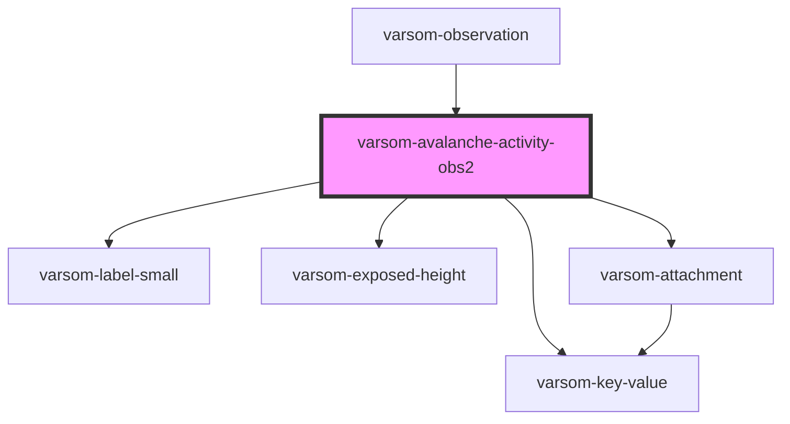

# varsom-avalanche-activity-obs2

<!-- Auto Generated Below -->

## Properties

| Property                 | Attribute                    | Description | Type           | Default     |
| ------------------------ | ---------------------------- | ----------- | -------------- | ----------- |
| `Attachments`            | --                           |             | `Attachment[]` | `undefined` |
| `AvalCauseName`          | `aval-cause-name`            |             | `string`       | `undefined` |
| `AvalCauseTID`           | `aval-cause-t-i-d`           |             | `number`       | `undefined` |
| `AvalPropagationName`    | `aval-propagation-name`      |             | `string`       | `undefined` |
| `AvalPropagationTID`     | `aval-propagation-t-i-d`     |             | `number`       | `undefined` |
| `AvalTriggerSimpleName`  | `aval-trigger-simple-name`   |             | `string`       | `undefined` |
| `AvalTriggerSimpleTID`   | `aval-trigger-simple-t-i-d`  |             | `number`       | `undefined` |
| `AvalancheExtName`       | `avalanche-ext-name`         |             | `string`       | `undefined` |
| `AvalancheExtTID`        | `avalanche-ext-t-i-d`        |             | `number`       | `undefined` |
| `Comment`                | `comment`                    |             | `string`       | `undefined` |
| `DestructiveSizeName`    | `destructive-size-name`      |             | `string`       | `undefined` |
| `DestructiveSizeTID`     | `destructive-size-t-i-d`     |             | `number`       | `undefined` |
| `DtEnd`                  | `dt-end`                     |             | `string`       | `undefined` |
| `DtStart`                | `dt-start`                   |             | `string`       | `undefined` |
| `EstimatedNumName`       | `estimated-num-name`         |             | `string`       | `undefined` |
| `EstimatedNumTID`        | `estimated-num-t-i-d`        |             | `number`       | `undefined` |
| `ExposedHeight1`         | `exposed-height-1`           |             | `number`       | `undefined` |
| `ExposedHeight2`         | `exposed-height-2`           |             | `number`       | `undefined` |
| `ExposedHeightComboName` | `exposed-height-combo-name`  |             | `string`       | `undefined` |
| `ExposedHeightComboTID`  | `exposed-height-combo-t-i-d` |             | `number`       | `undefined` |
| `ValidExposition`        | `valid-exposition`           |             | `string`       | `undefined` |
| `shortVersion`           | `short-version`              |             | `string`       | `undefined` |

## Dependencies

### Used by

 - [varsom-observation](../varsom-observation)

### Depends on

- [varsom-label-small](../varsom-label-small)
- [varsom-key-value](../varsom-key-value)
- [varsom-exposed-height](../varsom-exposed-height)
- [varsom-attachment](../varsom-attachment)

### Graph

----------------------------------------------

*Built with [StencilJS](https://stenciljs.com/)*
