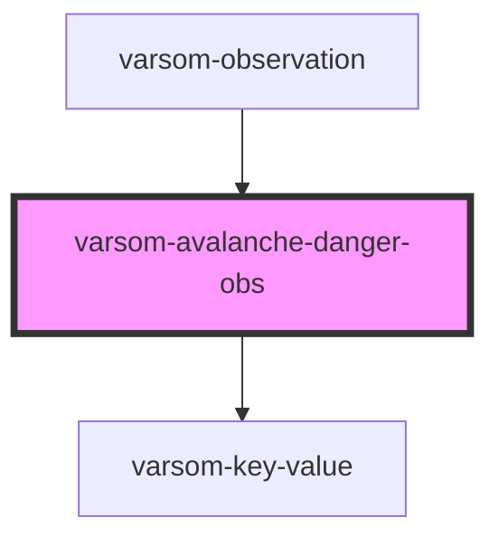

# varsom-danger-obs

<!-- Auto Generated Below -->

## Properties

| Property               | Attribute                  | Description | Type           | Default     |
| ---------------------- | -------------------------- | ----------- | -------------- | ----------- |
| `Attachments`          | --                         |             | `Attachment[]` | `undefined` |
| `AvalancheDangerObsID` | `avalanche-danger-obs-i-d` |             | `number`       | `undefined` |
| `Comment`              | `comment`                  |             | `string`       | `undefined` |
| `DangerSignName`       | `danger-sign-name`         |             | `string`       | `undefined` |
| `DangerSignTID`        | `danger-sign-t-i-d`        |             | `number`       | `undefined` |
| `shortVersion`         | `short-version`            |             | `string`       | `undefined` |

## Dependencies

### Used by

 - [varsom-observation](../varsom-observation)

### Depends on

- [varsom-key-value](../varsom-key-value)

### Graph

----------------------------------------------

*Built with [StencilJS](https://stenciljs.com/)*
