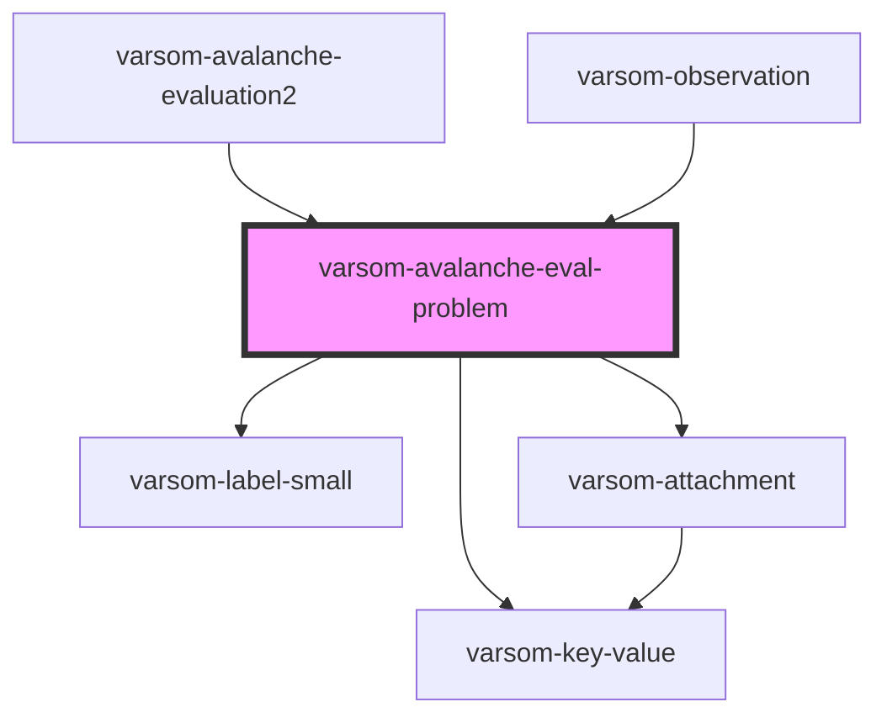

# varsom-avalanche-eval-problem

<!-- Auto Generated Below -->

## Properties

| Property                       | Attribute                         | Description | Type           | Default     |
| ------------------------------ | --------------------------------- | ----------- | -------------- | ----------- |
| `Attachments`                  | --                                |             | `Attachment[]` | `undefined` |
| `AvalCauseExtName`             | `aval-cause-ext-name`             |             | `string`       | `undefined` |
| `AvalCauseExtTID`              | `aval-cause-ext-t-i-d`            |             | `number`       | `undefined` |
| `AvalCauseName`                | `aval-cause-name`                 |             | `string`       | `undefined` |
| `AvalCauseTID`                 | `aval-cause-t-i-d`                |             | `number`       | `undefined` |
| `AvalProbabilityName`          | `aval-probability-name`           |             | `string`       | `undefined` |
| `AvalProbabilityTID`           | `aval-probability-t-i-d`          |             | `number`       | `undefined` |
| `AvalReleaseHeightName`        | `aval-release-height-name`        |             | `string`       | `undefined` |
| `AvalReleaseHeightTID`         | `aval-release-height-t-i-d`       |             | `number`       | `undefined` |
| `AvalTriggerSimpleName`        | `aval-trigger-simple-name`        |             | `string`       | `undefined` |
| `AvalTriggerSimpleTID`         | `aval-trigger-simple-t-i-d`       |             | `number`       | `undefined` |
| `AvalancheEvalProblemID`       | `avalanche-eval-problem-i-d`      |             | `number`       | `undefined` |
| `AvalancheExtName`             | `avalanche-ext-name`              |             | `string`       | `undefined` |
| `AvalancheExtTID`              | `avalanche-ext-t-i-d`             |             | `number`       | `undefined` |
| `AvalancheProbabilityAutoText` | `avalanche-probability-auto-text` |             | `string`       | `undefined` |
| `AvalancheProblemAutoText`     | `avalanche-problem-auto-text`     |             | `string`       | `undefined` |
| `Comment`                      | `comment`                         |             | `string`       | `undefined` |
| `DestructiveSizeExtName`       | `destructive-size-ext-name`       |             | `string`       | `undefined` |
| `DestructiveSizeExtTID`        | `destructive-size-ext-t-i-d`      |             | `number`       | `undefined` |
| `shortVersion`                 | `short-version`                   |             | `string`       | `undefined` |

## Dependencies

### Used by

 - [varsom-avalanche-evaluation2](../varsom-avalanche-evaluation2)
 - [varsom-observation](../varsom-observation)

### Depends on

- [varsom-label-small](../varsom-label-small)
- [varsom-key-value](../varsom-key-value)
- [varsom-attachment](../varsom-attachment)

### Graph

----------------------------------------------

*Built with [StencilJS](https://stenciljs.com/)*
