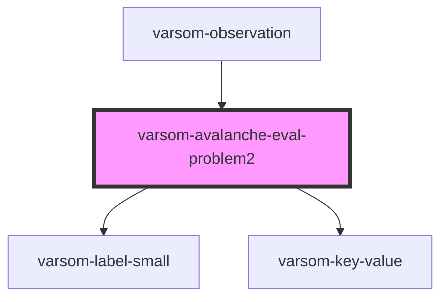

# varsom-avalanche-eval-problem2

<!-- Auto Generated Below -->

## Properties

| Property                        | Attribute                            | Description | Type           | Default     |
| ------------------------------- | ------------------------------------ | ----------- | -------------- | ----------- |
| `Attachments`                   | --                                   |             | `Attachment[]` | `undefined` |
| `AvalCauseAttributeCrystalName` | `aval-cause-attribute-crystal-name`  |             | `any`          | `undefined` |
| `AvalCauseAttributeCrystalTID`  | `aval-cause-attribute-crystal-t-i-d` |             | `any`          | `undefined` |
| `AvalCauseAttributeLightName`   | `aval-cause-attribute-light-name`    |             | `any`          | `undefined` |
| `AvalCauseAttributeLightTID`    | `aval-cause-attribute-light-t-i-d`   |             | `any`          | `undefined` |
| `AvalCauseAttributeSoftName`    | `aval-cause-attribute-soft-name`     |             | `any`          | `undefined` |
| `AvalCauseAttributeSoftTID`     | `aval-cause-attribute-soft-t-i-d`    |             | `any`          | `undefined` |
| `AvalCauseAttributeThinName`    | `aval-cause-attribute-thin-name`     |             | `any`          | `undefined` |
| `AvalCauseAttributeThinTID`     | `aval-cause-attribute-thin-t-i-d`    |             | `any`          | `undefined` |
| `AvalCauseDepthName`            | `aval-cause-depth-name`              |             | `any`          | `undefined` |
| `AvalCauseDepthTID`             | `aval-cause-depth-t-i-d`             |             | `any`          | `undefined` |
| `AvalCauseName`                 | `aval-cause-name`                    |             | `any`          | `undefined` |
| `AvalCauseTID`                  | `aval-cause-t-i-d`                   |             | `any`          | `undefined` |
| `AvalProbabilityName`           | `aval-probability-name`              |             | `any`          | `undefined` |
| `AvalProbabilityTID`            | `aval-probability-t-i-d`             |             | `any`          | `undefined` |
| `AvalPropagationName`           | `aval-propagation-name`              |             | `any`          | `undefined` |
| `AvalPropagationTID`            | `aval-propagation-t-i-d`             |             | `any`          | `undefined` |
| `AvalTriggerSimpleName`         | `aval-trigger-simple-name`           |             | `any`          | `undefined` |
| `AvalTriggerSimpleTID`          | `aval-trigger-simple-t-i-d`          |             | `any`          | `undefined` |
| `AvalancheExtName`              | `avalanche-ext-name`                 |             | `any`          | `undefined` |
| `AvalancheExtTID`               | `avalanche-ext-t-i-d`                |             | `any`          | `undefined` |
| `Comment`                       | `comment`                            |             | `any`          | `undefined` |
| `DestructiveSizeName`           | `destructive-size-name`              |             | `any`          | `undefined` |
| `DestructiveSizeTID`            | `destructive-size-t-i-d`             |             | `any`          | `undefined` |
| `ExposedHeight1`                | `exposed-height-1`                   |             | `any`          | `undefined` |
| `ExposedHeight2`                | `exposed-height-2`                   |             | `any`          | `undefined` |
| `ExposedHeightComboName`        | `exposed-height-combo-name`          |             | `any`          | `undefined` |
| `ExposedHeightComboTID`         | `exposed-height-combo-t-i-d`         |             | `any`          | `undefined` |
| `ValidExposition`               | `valid-exposition`                   |             | `any`          | `undefined` |
| `shortVersion`                  | `short-version`                      |             | `any`          | `undefined` |
| `strings`                       | `strings`                            |             | `any`          | `undefined` |

## Dependencies

### Used by

 - [varsom-observation](../varsom-observation)

### Depends on

- [varsom-label-small](../varsom-label-small)
- [varsom-key-value](../varsom-key-value)

### Graph

----------------------------------------------

*Built with [StencilJS](https://stenciljs.com/)*
