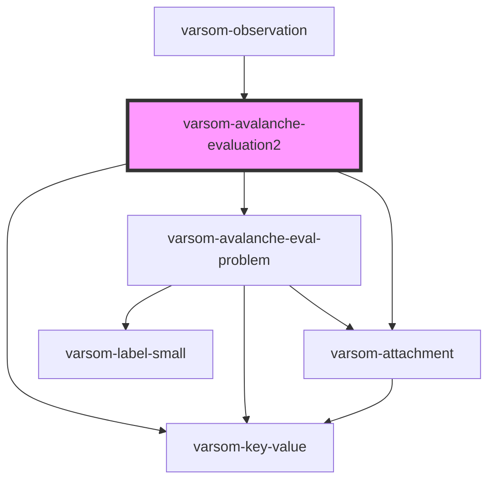

# varsom-avalanche-eval-problem2

<!-- Auto Generated Below -->

## Properties

| Property                 | Attribute                    | Description | Type                     | Default     |
| ------------------------ | ---------------------------- | ----------- | ------------------------ | ----------- |
| `Attachments`            | --                           |             | `Attachment[]`           | `undefined` |
| `AvalancheDangerName`    | `avalanche-danger-name`      |             | `string`                 | `undefined` |
| `AvalancheDangerTID`     | `avalanche-danger-t-i-d`     |             | `number`                 | `undefined` |
| `AvalancheDevelopment`   | `avalanche-development`      |             | `string`                 | `undefined` |
| `AvalancheEvalProblems`  | --                           |             | `AvalancheEvalProblem[]` | `undefined` |
| `AvalancheEvaluation`    | `avalanche-evaluation`       |             | `string`                 | `undefined` |
| `Comment`                | `comment`                    |             | `string`                 | `undefined` |
| `ExposedClimateName`     | `exposed-climate-name`       |             | `string`                 | `undefined` |
| `ExposedClimateTID`      | `exposed-climate-t-i-d`      |             | `number`                 | `undefined` |
| `ExposedHeight1`         | `exposed-height-1`           |             | `number`                 | `undefined` |
| `ExposedHeight2`         | `exposed-height-2`           |             | `number`                 | `undefined` |
| `ExposedHeightComboName` | `exposed-height-combo-name`  |             | `string`                 | `undefined` |
| `ExposedHeightComboTID`  | `exposed-height-combo-t-i-d` |             | `number`                 | `undefined` |
| `ValidExposition`        | `valid-exposition`           |             | `string`                 | `undefined` |
| `shortVersion`           | `short-version`              |             | `string`                 | `undefined` |

## Dependencies

### Used by

 - [varsom-observation](../varsom-observation)

### Depends on

- [varsom-key-value](../varsom-key-value)
- [varsom-avalanche-eval-problem](../varsom-avalanche-eval-problem)
- [varsom-attachment](../varsom-attachment)

### Graph

----------------------------------------------

*Built with [StencilJS](https://stenciljs.com/)*
