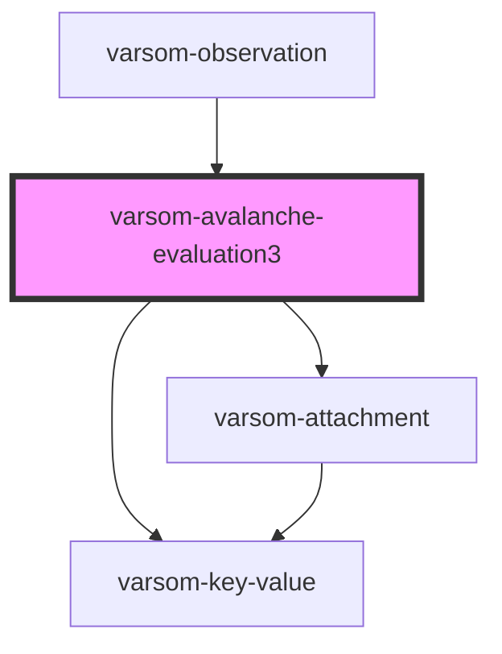

# varsom-avalanche-evaluation3

<!-- Auto Generated Below -->

## Properties

| Property               | Attribute                | Description | Type           | Default     |
| ---------------------- | ------------------------ | ----------- | -------------- | ----------- |
| `Attachments`          | --                       |             | `Attachment[]` | `undefined` |
| `AvalancheDangerName`  | `avalanche-danger-name`  |             | `string`       | `undefined` |
| `AvalancheDangerTID`   | `avalanche-danger-t-i-d` |             | `number`       | `undefined` |
| `AvalancheDevelopment` | `avalanche-development`  |             | `string`       | `undefined` |
| `AvalancheEvaluation`  | `avalanche-evaluation`   |             | `string`       | `undefined` |
| `ForecastComment`      | `forecast-comment`       |             | `string`       | `undefined` |
| `ForecastCorrectName`  | `forecast-correct-name`  |             | `string`       | `undefined` |
| `ForecastCorrectTID`   | `forecast-correct-t-i-d` |             | `number`       | `undefined` |
| `shortVersion`         | `short-version`          |             | `string`       | `undefined` |

## Dependencies

### Used by

 - [varsom-observation](../varsom-observation)

### Depends on

- [varsom-key-value](../varsom-key-value)
- [varsom-attachment](../varsom-attachment)

### Graph

----------------------------------------------

*Built with [StencilJS](https://stenciljs.com/)*
