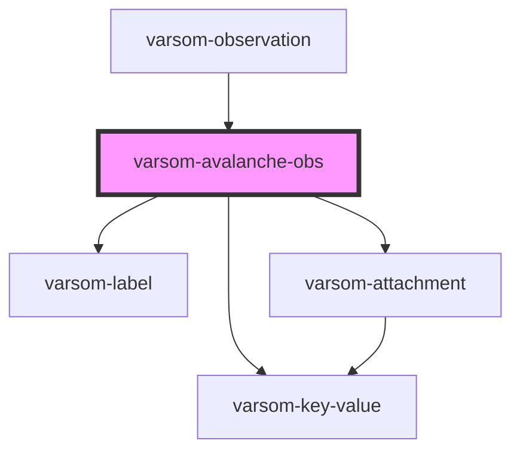

# varsom-avalanche-obs2

<!-- Auto Generated Below -->

## Properties

| Property               | Attribute                  | Description | Type           | Default     |
| ---------------------- | -------------------------- | ----------- | -------------- | ----------- |
| `Aspect`               | `aspect`                   |             | `any`          | `undefined` |
| `Attachments`          | --                         |             | `Attachment[]` | `undefined` |
| `AvalCauseName`        | `aval-cause-name`          |             | `any`          | `undefined` |
| `AvalCauseTID`         | `aval-cause-t-i-d`         |             | `any`          | `undefined` |
| `AvalancheName`        | `avalanche-name`           |             | `any`          | `undefined` |
| `AvalancheTID`         | `avalanche-t-i-d`          |             | `any`          | `undefined` |
| `AvalancheTriggerName` | `avalanche-trigger-name`   |             | `any`          | `undefined` |
| `AvalancheTriggerTID`  | `avalanche-trigger-t-i-d`  |             | `any`          | `undefined` |
| `Comment`              | `comment`                  |             | `any`          | `undefined` |
| `DestructiveSizeName`  | `destructive-size-name`    |             | `any`          | `undefined` |
| `DestructiveSizeTID`   | `destructive-size-t-i-d`   |             | `any`          | `undefined` |
| `DtAvalancheTime`      | `dt-avalanche-time`        |             | `any`          | `undefined` |
| `FractureHeight`       | `fracture-height`          |             | `any`          | `undefined` |
| `FractureWidth`        | `fracture-width`           |             | `any`          | `undefined` |
| `HeightStartZone`      | `height-start-zone`        |             | `any`          | `undefined` |
| `HeightStopZone`       | `height-stop-zone`         |             | `any`          | `undefined` |
| `RemotelyTriggered`    | `remotely-triggered`       |             | `any`          | `undefined` |
| `SnowLine`             | `snow-line`                |             | `any`          | `undefined` |
| `StartLat`             | `start-lat`                |             | `any`          | `undefined` |
| `StartLong`            | `start-long`               |             | `any`          | `undefined` |
| `StopLat`              | `stop-lat`                 |             | `any`          | `undefined` |
| `StopLong`             | `stop-long`                |             | `any`          | `undefined` |
| `TerrainStartZoneName` | `terrain-start-zone-name`  |             | `any`          | `undefined` |
| `TerrainStartZoneTID`  | `terrain-start-zone-t-i-d` |             | `any`          | `undefined` |
| `Trajectory`           | `trajectory`               |             | `any`          | `undefined` |
| `ValidExposition`      | `valid-exposition`         |             | `any`          | `undefined` |
| `shortVersion`         | `short-version`            |             | `any`          | `undefined` |
| `strings`              | `strings`                  |             | `any`          | `undefined` |

## Dependencies

### Used by

 - [varsom-observation](../varsom-observation)

### Depends on

- [varsom-label](../varsom-label)
- [varsom-key-value](../varsom-key-value)
- [varsom-attachment](../varsom-attachment)

### Graph

----------------------------------------------

*Built with [StencilJS](https://stenciljs.com/)*
