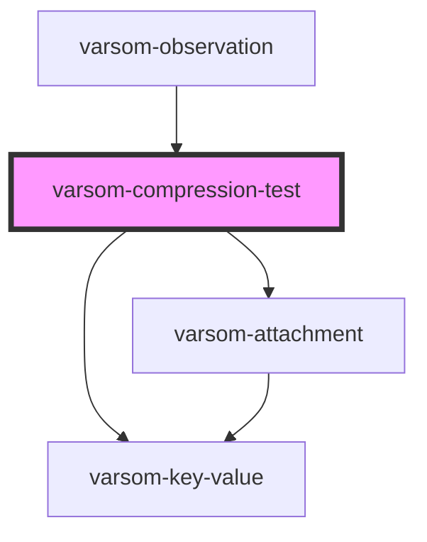

# varsom-compression-test

<!-- Auto Generated Below -->

## Properties

| Property                | Attribute                   | Description | Type           | Default     |
| ----------------------- | --------------------------- | ----------- | -------------- | ----------- |
| `Attachments`           | --                          |             | `Attachment[]` | `undefined` |
| `Comment`               | `comment`                   |             | `any`          | `undefined` |
| `ComprTestFractureName` | `compr-test-fracture-name`  |             | `any`          | `undefined` |
| `ComprTestFractureTID`  | `compr-test-fracture-t-i-d` |             | `any`          | `undefined` |
| `CompressionTestName`   | `compression-test-name`     |             | `any`          | `undefined` |
| `CompressionTestTID`    | `compression-test-t-i-d`    |             | `any`          | `undefined` |
| `FractureDepth`         | `fracture-depth`            |             | `any`          | `undefined` |
| `IncludeInSnowProfile`  | `include-in-snow-profile`   |             | `any`          | `undefined` |
| `PropagationName`       | `propagation-name`          |             | `any`          | `undefined` |
| `PropagationTID`        | `propagation-t-i-d`         |             | `any`          | `undefined` |
| `PstX`                  | `pst-x`                     |             | `any`          | `undefined` |
| `PstY`                  | `pst-y`                     |             | `any`          | `undefined` |
| `RbRelease`             | `rb-release`                |             | `any`          | `undefined` |
| `StabilityEvalName`     | `stability-eval-name`       |             | `any`          | `undefined` |
| `StabilityEvalTID`      | `stability-eval-t-i-d`      |             | `any`          | `undefined` |
| `TapsFracture`          | `taps-fracture`             |             | `any`          | `undefined` |
| `TapsFullPropagation`   | `taps-full-propagation`     |             | `any`          | `undefined` |
| `shortVersion`          | `short-version`             |             | `any`          | `undefined` |

## Dependencies

### Used by

 - [varsom-observation](../varsom-observation)

### Depends on

- [varsom-key-value](../varsom-key-value)
- [varsom-attachment](../varsom-attachment)

### Graph

----------------------------------------------

*Built with [StencilJS](https://stenciljs.com/)*
