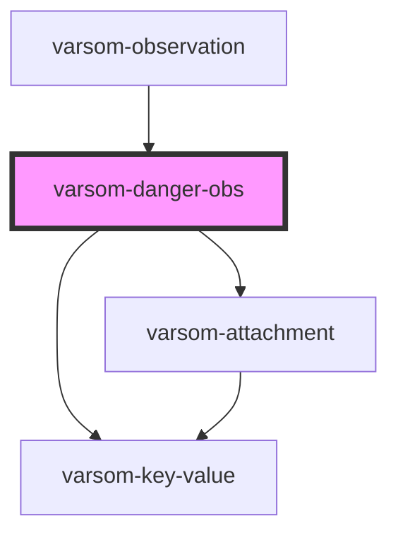

# varsom-danger-obs

<!-- Auto Generated Below -->

## Properties

| Property         | Attribute           | Description | Type           | Default     |
| ---------------- | ------------------- | ----------- | -------------- | ----------- |
| `Attachments`    | --                  |             | `Attachment[]` | `undefined` |
| `Comment`        | `comment`           |             | `any`          | `undefined` |
| `DangerSignName` | `danger-sign-name`  |             | `any`          | `undefined` |
| `DangerSignTID`  | `danger-sign-t-i-d` |             | `any`          | `undefined` |
| `GeoHazardName`  | `geo-hazard-name`   |             | `any`          | `undefined` |
| `GeoHazardTID`   | `geo-hazard-t-i-d`  |             | `any`          | `undefined` |
| `shortVersion`   | `short-version`     |             | `any`          | `undefined` |
| `strings`        | `strings`           |             | `any`          | `undefined` |

## Dependencies

### Used by

- [varsom-observation](../varsom-observation)

### Depends on

- [varsom-key-value](../varsom-key-value)
- [varsom-attachment](../varsom-attachment)

### Graph

---

_Built with [StencilJS](https://stenciljs.com/)_
