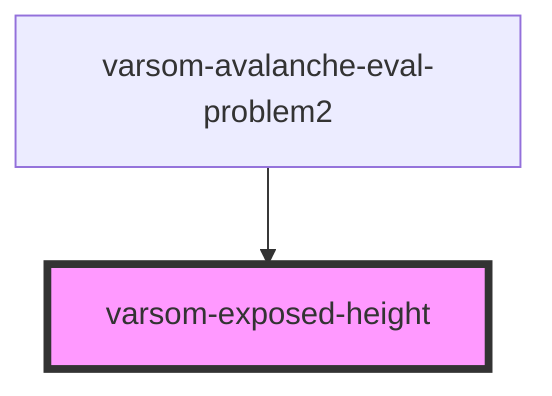

# varsom-exposed-height

<!-- Auto Generated Below -->

## Properties

| Property          | Attribute          | Description | Type  | Default     |
| ----------------- | ------------------ | ----------- | ----- | ----------- |
| `ExposedHeight1`  | `exposed-height-1` |             | `any` | `undefined` |
| `ExposedHeight2`  | `exposed-height-2` |             | `any` | `undefined` |
| `ValidExposition` | `valid-exposition` |             | `any` | `undefined` |

## Dependencies

### Used by

 - [varsom-avalanche-eval-problem2](../varsom-avalanche-eval-problem2)

### Graph

----------------------------------------------

*Built with [StencilJS](https://stenciljs.com/)*
