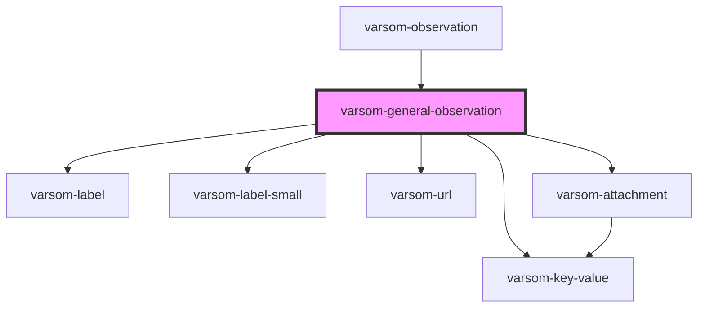

# varsom-snow-surface

<!-- Auto Generated Below -->

## Properties

| Property        | Attribute          | Description | Type           | Default     |
| --------------- | ------------------ | ----------- | -------------- | ----------- |
| `Attachments`   | --                 |             | `Attachment[]` | `undefined` |
| `Comment`       | `comment`          |             | `string`       | `undefined` |
| `GeoHazardName` | `geo-hazard-name`  |             | `string`       | `undefined` |
| `GeoHazardTID`  | `geo-hazard-t-i-d` |             | `number`       | `undefined` |
| `ObsComment`    | `obs-comment`      |             | `string`       | `undefined` |
| `ObsHeader`     | `obs-header`       |             | `string`       | `undefined` |
| `Urls`          | --                 |             | `Url[]`        | `undefined` |
| `shortVersion`  | `short-version`    |             | `string`       | `undefined` |

## Dependencies

### Used by

 - [varsom-observation](../varsom-observation)

### Depends on

- [varsom-label](../varsom-label)
- [varsom-label-small](../varsom-label-small)
- [varsom-key-value](../varsom-key-value)
- [varsom-url](../varsom-url)
- [varsom-attachment](../varsom-attachment)

### Graph

----------------------------------------------

*Built with [StencilJS](https://stenciljs.com/)*
