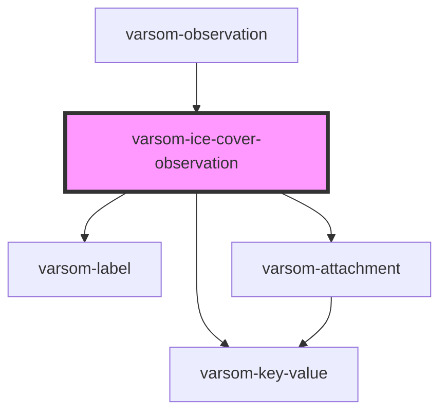

# varsom-ice-thickness

<!-- Auto Generated Below -->

## Properties

| Property              | Attribute                | Description | Type           | Default     |
| --------------------- | ------------------------ | ----------- | -------------- | ----------- |
| `Attachments`         | --                       |             | `Attachment[]` | `undefined` |
| `Comment`             | `comment`                |             | `any`          | `undefined` |
| `IceCapacityName`     | `ice-capacity-name`      |             | `any`          | `undefined` |
| `IceCapacityTID`      | `ice-capacity-t-i-d`     |             | `any`          | `undefined` |
| `IceCoverAfterName`   | `ice-cover-after-name`   |             | `any`          | `undefined` |
| `IceCoverAfterTID`    | `ice-cover-after-t-i-d`  |             | `any`          | `undefined` |
| `IceCoverBeforeName`  | `ice-cover-before-name`  |             | `any`          | `undefined` |
| `IceCoverBeforeTID`   | `ice-cover-before-t-i-d` |             | `any`          | `undefined` |
| `IceCoverName`        | `ice-cover-name`         |             | `any`          | `undefined` |
| `IceCoverTID`         | `ice-cover-t-i-d`        |             | `any`          | `undefined` |
| `IceSkateabilityName` | `ice-skateability-name`  |             | `any`          | `undefined` |
| `IceSkateabilityTID`  | `ice-skateability-t-i-d` |             | `any`          | `undefined` |
| `shortVersion`        | `short-version`          |             | `any`          | `undefined` |
| `strings`             | `strings`                |             | `any`          | `undefined` |

## Dependencies

### Used by

- [varsom-observation](../varsom-observation)

### Depends on

- [varsom-label](../varsom-label)
- [varsom-key-value](../varsom-key-value)
- [varsom-attachment](../varsom-attachment)

### Graph

---

_Built with [StencilJS](https://stenciljs.com/)_
