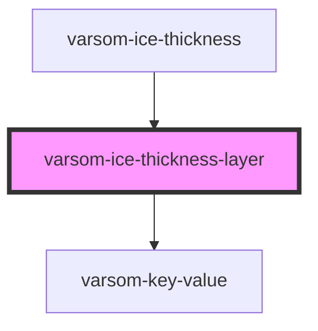

# varsom-ice-thickness

<!-- Auto Generated Below -->

## Properties

| Property            | Attribute             | Description | Type  | Default     |
| ------------------- | --------------------- | ----------- | ----- | ----------- |
| `Comment`           | `comment`             |             | `any` | `undefined` |
| `IceLayerName`      | `ice-layer-name`      |             | `any` | `undefined` |
| `IceLayerThickness` | `ice-layer-thickness` |             | `any` | `undefined` |
| `shortVersion`      | `short-version`       |             | `any` | `undefined` |
| `strings`           | `strings`             |             | `any` | `undefined` |

## Dependencies

### Used by

 - [varsom-ice-thickness](../varsom-ice-thickness)

### Depends on

- [varsom-key-value](../varsom-key-value)

### Graph

----------------------------------------------

*Built with [StencilJS](https://stenciljs.com/)*
