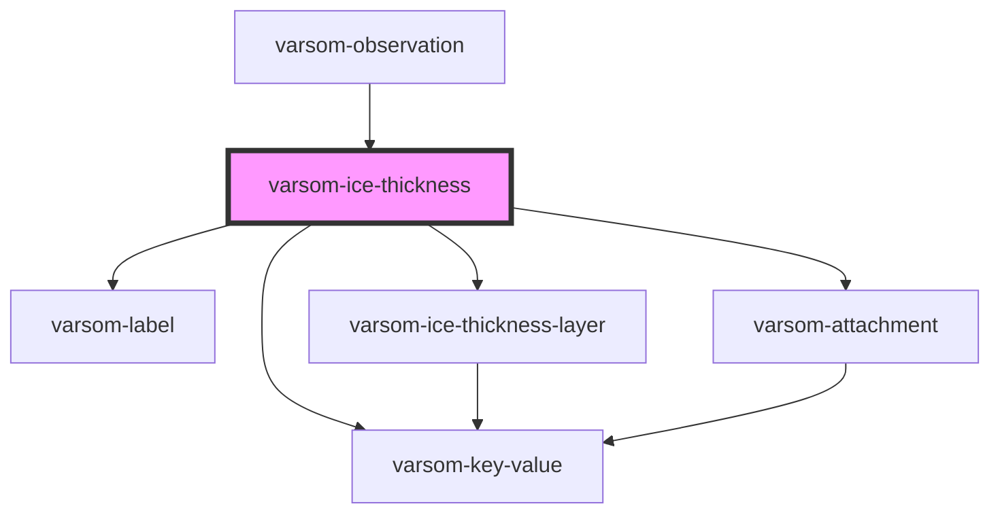

# varsom-ice-thickness

<!-- Auto Generated Below -->

## Properties

| Property             | Attribute           | Description | Type                  | Default     |
| -------------------- | ------------------- | ----------- | --------------------- | ----------- |
| `Attachments`        | --                  |             | `Attachment[]`        | `undefined` |
| `Comment`            | `comment`           |             | `string`              | `undefined` |
| `DtObsTime`          | `dt-obs-time`       |             | `string`              | `undefined` |
| `HardCodedImg`       | `hard-coded-img`    |             | `string`              | `undefined` |
| `IceHeightAfter`     | `ice-height-after`  |             | `number`              | `undefined` |
| `IceHeightBefore`    | `ice-height-before` |             | `number`              | `undefined` |
| `IceThicknessLayers` | --                  |             | `IceThicknessLayer[]` | `undefined` |
| `IceThicknessSum`    | `ice-thickness-sum` |             | `number`              | `undefined` |
| `LocationName`       | `location-name`     |             | `string`              | `undefined` |
| `ObsLocationId`      | `obs-location-id`   |             | `number`              | `undefined` |
| `SlushSnow`          | `slush-snow`        |             | `number`              | `undefined` |
| `SnowDepth`          | `snow-depth`        |             | `number`              | `undefined` |
| `regId`              | `reg-id`            |             | `number`              | `undefined` |
| `shortVersion`       | `short-version`     |             | `string`              | `undefined` |

## Dependencies

### Used by

 - [varsom-observation](../varsom-observation)

### Depends on

- [varsom-label](../varsom-label)
- [varsom-ice-thickness-layer](../varsom-ice-thickness-layer)
- [varsom-key-value](../varsom-key-value)
- [varsom-attachment](../varsom-attachment)

### Graph

----------------------------------------------

*Built with [StencilJS](https://stenciljs.com/)*
