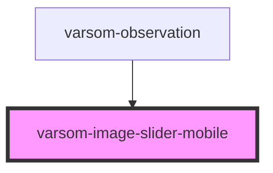

# varsom-attachment

<!-- Auto Generated Below -->

## Properties

| Property       | Attribute       | Description | Type                                                                                                                                                                                                                                                                                                                                                                                                                                                                                                                                                                                                                                                                                                                                                                                                                                                                                                                                                                                                                                                                                                                                                                                                                                                                                                                                                                                                                                                                                                                                                                                                                                                                 | Default     |
| -------------- | --------------- | ----------- | -------------------------------------------------------------------------------------------------------------------------------------------------------------------------------------------------------------------------------------------------------------------------------------------------------------------------------------------------------------------------------------------------------------------------------------------------------------------------------------------------------------------------------------------------------------------------------------------------------------------------------------------------------------------------------------------------------------------------------------------------------------------------------------------------------------------------------------------------------------------------------------------------------------------------------------------------------------------------------------------------------------------------------------------------------------------------------------------------------------------------------------------------------------------------------------------------------------------------------------------------------------------------------------------------------------------------------------------------------------------------------------------------------------------------------------------------------------------------------------------------------------------------------------------------------------------------------------------------------------------------------------------------------------------- | ----------- |
| `_images`      | --              |             | `any[]`                                                                                                                                                                                                                                                                                                                                                                                                                                                                                                                                                                                                                                                                                                                                                                                                                                                                                                                                                                                                                                                                                                                                                                                                                                                                                                                                                                                                                                                                                                                                                                                                                                                              | `undefined` |
| `observation`  | --              |             | `{ _moh?: number; _geoHazardName?: string; _registrationName?: string; _imageUrl?: string; _region?: string; _regId?: number; _municipality?: string; _source?: string; _sourceOfPositioning?: string; _precision?: string; _dateOfObservation?: Date; _dateOfRegistration?: Date; _dateOfLastUpdate?: Date; _observer?: Observer; _typeOfWeather?: string; _latitude?: number; _longitude?: number; _signsOfDanger?: SignsOfDanger; _dangerObs?: DangerObs[]; _landslideObs?: LandslideObs; _avalancheObs?: AvalancheObs; _weather?: WeatherObservation; _test?: Test; _snowProfile?: SnowProfile; _landslideProblem?: LandslideProblem; _estimateOfRisk?: EstimateOfRisk; _snowSurfaceObservation?: SnowSurfaceObservation; _dataSource?: any; _className?: string; _observationImages?: HTMLElement[]; Attachments?: Attachment[]; _observerGroupName?: string; _avalancheActivityObs2?: AvalancheActivityObs2[]; _iceCoverObs?: IceCoverObs; _iceThickness?: IceThickness; _waterLevel2?: WaterLevel2; _damageObs?: DamageObs[]; _obsLocation?: ObsLocation; _avalancheEvalProblem?: AvalancheEvalProblem[]; _avalancheEvalProblem2?: AvalancheEvalProblem2[]; _avalancheEvaluation3?: AvalancheEvaluation3; _compressionTest?: CompressionTest[]; _generalObservation?: GeneralObservation; _incident?: Incident; _snowProfile2?: SnowProfile2; _avalancheEvaluation?: AvalancheEvaluation; _avalancheActivityObs?: AvalancheActivityObs; _avalancheDangerObs?: AvalancheDangerObs[]; _avalancheEvaluation2?: AvalancheEvaluation2; _snowCoverObs?: SnowCoverObs; _waterLevel?: WaterLevel; _images?: Image[]; _dtObsTime?: string; _loopNumbers?: number[]; }` | `undefined` |
| `shortVersion` | `short-version` |             | `string`                                                                                                                                                                                                                                                                                                                                                                                                                                                                                                                                                                                                                                                                                                                                                                                                                                                                                                                                                                                                                                                                                                                                                                                                                                                                                                                                                                                                                                                                                                                                                                                                                                                             | `undefined` |
| `strings`      | `strings`       |             | `any`                                                                                                                                                                                                                                                                                                                                                                                                                                                                                                                                                                                                                                                                                                                                                                                                                                                                                                                                                                                                                                                                                                                                                                                                                                                                                                                                                                                                                                                                                                                                                                                                                                                                | `undefined` |

## Dependencies

### Used by

 - [varsom-observation](../varsom-observation)

### Graph

----------------------------------------------

*Built with [StencilJS](https://stenciljs.com/)*
