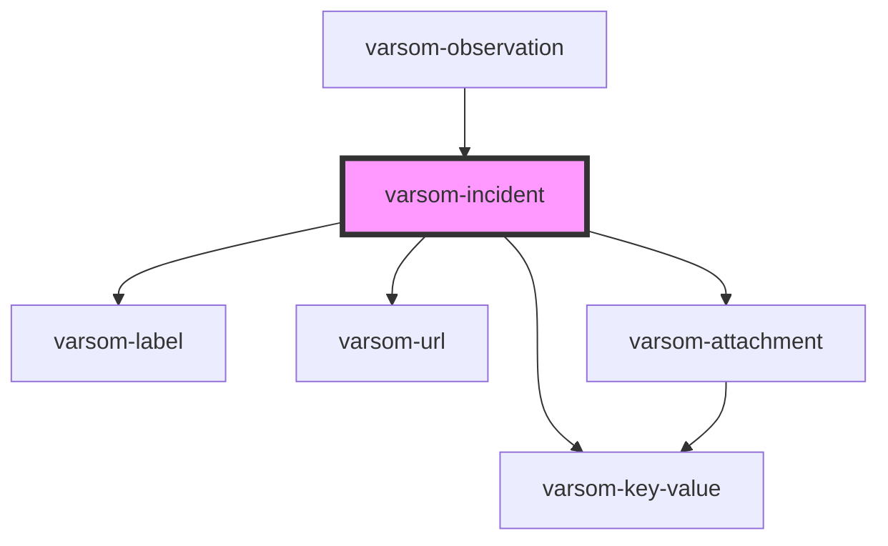

# varsom-avalanche-eval-problem

<!-- Auto Generated Below -->

## Properties

| Property                 | Attribute                   | Description | Type           | Default     |
| ------------------------ | --------------------------- | ----------- | -------------- | ----------- |
| `ActivityInfluencedName` | `activity-influenced-name`  |             | `any`          | `undefined` |
| `ActivityInfluencedTID`  | `activity-influenced-t-i-d` |             | `any`          | `undefined` |
| `Attachments`            | --                          |             | `Attachment[]` | `undefined` |
| `CasualtiesNum`          | `casualties-num`            |             | `any`          | `undefined` |
| `Comment`                | `comment`                   |             | `any`          | `undefined` |
| `DamageExtentName`       | `damage-extent-name`        |             | `any`          | `undefined` |
| `DamageExtentTID`        | `damage-extent-t-i-d`       |             | `any`          | `undefined` |
| `DeadNum`                | `dead-num`                  |             | `any`          | `undefined` |
| `DtEndTime`              | `dt-end-time`               |             | `any`          | `undefined` |
| `EvacuatedNum`           | `evacuated-num`             |             | `any`          | `undefined` |
| `ForecastAccurateName`   | `forecast-accurate-name`    |             | `any`          | `undefined` |
| `ForecastAccurateTID`    | `forecast-accurate-t-i-d`   |             | `any`          | `undefined` |
| `GeoHazardName`          | `geo-hazard-name`           |             | `any`          | `undefined` |
| `GeoHazardTID`           | `geo-hazard-t-i-d`          |             | `any`          | `undefined` |
| `HarmedNum`              | `harmed-num`                |             | `any`          | `undefined` |
| `IncidentHeader`         | `incident-header`           |             | `any`          | `undefined` |
| `IncidentIngress`        | `incident-ingress`          |             | `any`          | `undefined` |
| `IncidentText`           | `incident-text`             |             | `any`          | `undefined` |
| `IncidentURLs`           | --                          |             | `any[]`        | `undefined` |
| `InvolvedNum`            | `involved-num`              |             | `any`          | `undefined` |
| `LocalKnowledgeName`     | `local-knowledge-name`      |             | `any`          | `undefined` |
| `LocalKnowledgeTID`      | `local-knowledge-t-i-d`     |             | `any`          | `undefined` |
| `LocalTouristName`       | `local-tourist-name`        |             | `any`          | `undefined` |
| `LocalTouristTID`        | `local-tourist-t-i-d`       |             | `any`          | `undefined` |
| `MaterialDamages`        | `material-damages`          |             | `any`          | `undefined` |
| `RescueName`             | `rescue-name`               |             | `any`          | `undefined` |
| `RescueTID`              | `rescue-t-i-d`              |             | `any`          | `undefined` |
| `SafetyGearName`         | `safety-gear-name`          |             | `any`          | `undefined` |
| `SafetyGearTID`          | `safety-gear-t-i-d`         |             | `any`          | `undefined` |
| `SlopeActivityName`      | `slope-activity-name`       |             | `any`          | `undefined` |
| `SlopeActivityTID`       | `slope-activity-t-i-d`      |             | `any`          | `undefined` |
| `TrafficObstructed`      | `traffic-obstructed`        |             | `any`          | `undefined` |
| `shortVersion`           | `short-version`             |             | `any`          | `undefined` |

## Dependencies

### Used by

 - [varsom-observation](../varsom-observation)

### Depends on

- [varsom-label](../varsom-label)
- [varsom-key-value](../varsom-key-value)
- [varsom-url](../varsom-url)
- [varsom-attachment](../varsom-attachment)

### Graph

----------------------------------------------

*Built with [StencilJS](https://stenciljs.com/)*
