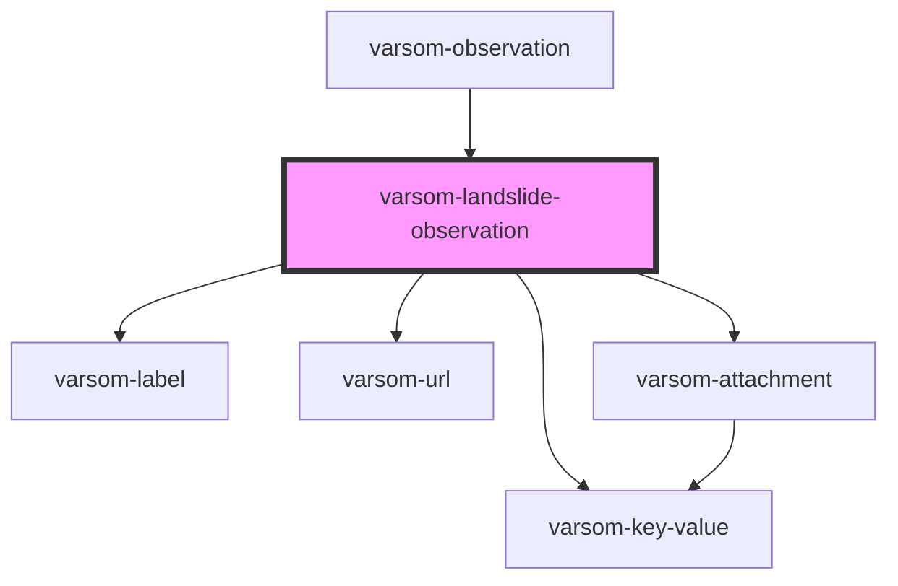

# varsom-avalanche-eval-problem

<!-- Auto Generated Below -->

## Properties

| Property                 | Attribute                   | Description | Type           | Default     |
| ------------------------ | --------------------------- | ----------- | -------------- | ----------- |
| `ActivityInfluencedName` | `activity-influenced-name`  |             | `string`       | `undefined` |
| `ActivityInfluencedTID`  | `activity-influenced-t-i-d` |             | `number`       | `undefined` |
| `Attachments`            | --                          |             | `Attachment[]` | `undefined` |
| `Comment`                | `comment`                   |             | `string`       | `undefined` |
| `DamageExtentName`       | `damage-extent-name`        |             | `string`       | `undefined` |
| `DamageExtentTID`        | `damage-extent-t-i-d`       |             | `number`       | `undefined` |
| `DtLandSlideTime`        | `dt-land-slide-time`        |             | `string`       | `undefined` |
| `DtLandSlideTimeEnd`     | `dt-land-slide-time-end`    |             | `string`       | `undefined` |
| `ForecastAccurateName`   | `forecast-accurate-name`    |             | `string`       | `undefined` |
| `ForecastAccurateTID`    | `forecast-accurate-t-i-d`   |             | `number`       | `undefined` |
| `GeoHazardName`          | `geo-hazard-name`           |             | `string`       | `undefined` |
| `GeoHazardTID`           | `geo-hazard-t-i-d`          |             | `number`       | `undefined` |
| `LandSlideName`          | `land-slide-name`           |             | `string`       | `undefined` |
| `LandSlideSizeName`      | `land-slide-size-name`      |             | `string`       | `undefined` |
| `LandSlideSizeTID`       | `land-slide-size-t-i-d`     |             | `number`       | `undefined` |
| `LandSlideTID`           | `land-slide-t-i-d`          |             | `number`       | `undefined` |
| `LandSlideTriggerName`   | `land-slide-trigger-name`   |             | `string`       | `undefined` |
| `LandSlideTriggerTID`    | `land-slide-trigger-t-i-d`  |             | `number`       | `undefined` |
| `StartLat`               | `start-lat`                 |             | `number`       | `undefined` |
| `StartLong`              | `start-long`                |             | `number`       | `undefined` |
| `StopLat`                | `stop-lat`                  |             | `number`       | `undefined` |
| `StopLong`               | `stop-long`                 |             | `number`       | `undefined` |
| `Urls`                   | --                          |             | `Url[]`        | `undefined` |
| `shortVersion`           | `short-version`             |             | `string`       | `undefined` |

## Dependencies

### Used by

 - [varsom-observation](../varsom-observation)

### Depends on

- [varsom-label](../varsom-label)
- [varsom-key-value](../varsom-key-value)
- [varsom-url](../varsom-url)
- [varsom-attachment](../varsom-attachment)

### Graph

----------------------------------------------

*Built with [StencilJS](https://stenciljs.com/)*
