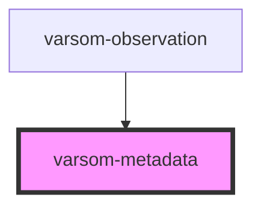

# varsom-metadata

<!-- Auto Generated Below -->

## Properties

| Property              | Attribute               | Description | Type     | Default     |
| --------------------- | ----------------------- | ----------- | -------- | ----------- |
| `competenceLevelName` | `competence-level-name` |             | `any`    | `undefined` |
| `dateOfLastUpdate`    | `date-of-last-update`   |             | `any`    | `undefined` |
| `dateOfRegistration`  | `date-of-registration`  |             | `any`    | `undefined` |
| `geoHazardName`       | `geo-hazard-name`       |             | `any`    | `undefined` |
| `moh`                 | `moh`                   |             | `any`    | `undefined` |
| `nickname`            | `nickname`              |             | `any`    | `undefined` |
| `observerGroupName`   | `observer-group-name`   |             | `any`    | `undefined` |
| `shortVersion`        | `short-version`         |             | `string` | `undefined` |
| `strings`             | `strings`               |             | `any`    | `undefined` |

## Dependencies

### Used by

- [varsom-observation](../varsom-observation)

### Graph

---

_Built with [StencilJS](https://stenciljs.com/)_
