# varsom-schema

<!-- Auto Generated Below -->

## Properties

| Property   | Attribute  | Description | Type     | Default     |
| ---------- | ---------- | ----------- | -------- | ----------- |
| `count`    | `count`    |             | `number` | `1`         |
| `json`     | `json`     |             | `any`    | `undefined` |
| `language` | `language` |             | `string` | `"nb"`      |
| `number`   | `number`   |             | `number` | `1`         |
| `regid`    | `regid`    |             | `string` | `undefined` |
| `type`     | `type`     |             | `string` | `undefined` |
| `version`  | `version`  |             | `string` | `undefined` |

## Dependencies

### Depends on

- [varsom-header](../varsom-header)
- [varsom-metadata](../varsom-metadata)
- [varsom-image-slider-mobile](../varsom-image-slider-mobile)
- [varsom-image-slider](../varsom-image-slider)
- [varsom-damage-obs](../varsom-damage-obs)
- [varsom-label](../varsom-label)
- [varsom-avalanche-activity-obs2](../varsom-avalanche-activity-obs2)
- [varsom-avalanche-activity-obs](../varsom-avalanche-activity-obs)
- [varsom-avalanche-obs](../varsom-avalanche-obs)
- [varsom-water-level](../varsom-water-level)
- [varsom-water-level2](../varsom-water-level2)
- [varsom-water-measurement](../varsom-water-measurement)
- [varsom-ice-thickness](../varsom-ice-thickness)
- [varsom-landslide-observation](../varsom-landslide-observation)
- [varsom-weather-observation](../varsom-weather-observation)
- [varsom-avalanche-eval-problem](../varsom-avalanche-eval-problem)
- [varsom-avalanche-eval-problem2](../varsom-avalanche-eval-problem2)
- [varsom-avalanche-evaluation](../varsom-avalanche-evaluation)
- [varsom-avalanche-evaluation2](../varsom-avalanche-evaluation2)
- [varsom-avalanche-evaluation3](../varsom-avalanche-evaluation3)
- [varsom-snow-profile](../varsom-snow-profile)
- [varsom-snow-profile2](../varsom-snow-profile2)
- [varsom-danger-obs](../varsom-danger-obs)
- [varsom-avalanche-danger-obs](../varsom-avalanche-danger-obs)
- [varsom-compression-test](../varsom-compression-test)
- [varsom-snow-surface-observation](../varsom-snow-surface-observation)
- [varsom-ice-cover-observation](../varsom-ice-cover-observation)
- [varsom-general-observation](../varsom-general-observation)
- [varsom-incident](../varsom-incident)
- [varsom-attachment](../varsom-attachment)
- [varsom-regobs-link](../varsom-regobs-link)

### Graph

```mermaid
graph TD;
  varsom-observation --> varsom-header
  varsom-observation --> varsom-metadata
  varsom-observation --> varsom-image-slider-mobile
  varsom-observation --> varsom-image-slider
  varsom-observation --> varsom-damage-obs
  varsom-observation --> varsom-label
  varsom-observation --> varsom-avalanche-activity-obs2
  varsom-observation --> varsom-avalanche-activity-obs
  varsom-observation --> varsom-avalanche-obs
  varsom-observation --> varsom-water-level
  varsom-observation --> varsom-water-level2
  varsom-observation --> varsom-water-measurement
  varsom-observation --> varsom-ice-thickness
  varsom-observation --> varsom-landslide-observation
  varsom-observation --> varsom-weather-observation
  varsom-observation --> varsom-avalanche-eval-problem
  varsom-observation --> varsom-avalanche-eval-problem2
  varsom-observation --> varsom-avalanche-evaluation
  varsom-observation --> varsom-avalanche-evaluation2
  varsom-observation --> varsom-avalanche-evaluation3
  varsom-observation --> varsom-snow-profile
  varsom-observation --> varsom-snow-profile2
  varsom-observation --> varsom-danger-obs
  varsom-observation --> varsom-avalanche-danger-obs
  varsom-observation --> varsom-compression-test
  varsom-observation --> varsom-snow-surface-observation
  varsom-observation --> varsom-ice-cover-observation
  varsom-observation --> varsom-general-observation
  varsom-observation --> varsom-incident
  varsom-observation --> varsom-attachment
  varsom-observation --> varsom-regobs-link
  varsom-damage-obs --> varsom-label
  varsom-damage-obs --> varsom-key-value
  varsom-damage-obs --> varsom-attachment
  varsom-attachment --> varsom-key-value
  varsom-avalanche-activity-obs2 --> varsom-label-small
  varsom-avalanche-activity-obs2 --> varsom-key-value
  varsom-avalanche-activity-obs2 --> varsom-attachment
  varsom-avalanche-activity-obs --> varsom-key-value
  varsom-avalanche-activity-obs --> varsom-attachment
  varsom-avalanche-obs --> varsom-label
  varsom-avalanche-obs --> varsom-key-value
  varsom-avalanche-obs --> varsom-attachment
  varsom-water-level --> varsom-label-small
  varsom-water-level --> varsom-key-value
  varsom-water-level --> varsom-attachment
  varsom-water-level2 --> varsom-label
  varsom-water-level2 --> varsom-key-value
  varsom-water-level2 --> varsom-water-measurement
  varsom-water-level2 --> varsom-attachment
  varsom-water-measurement --> varsom-label-small
  varsom-water-measurement --> varsom-key-value
  varsom-ice-thickness --> varsom-label
  varsom-ice-thickness --> varsom-ice-thickness-layer
  varsom-ice-thickness --> varsom-key-value
  varsom-ice-thickness --> varsom-attachment
  varsom-ice-thickness-layer --> varsom-key-value
  varsom-landslide-observation --> varsom-label
  varsom-landslide-observation --> varsom-key-value
  varsom-landslide-observation --> varsom-url
  varsom-landslide-observation --> varsom-attachment
  varsom-weather-observation --> varsom-label
  varsom-weather-observation --> varsom-key-value
  varsom-weather-observation --> varsom-attachment
  varsom-avalanche-eval-problem --> varsom-label-small
  varsom-avalanche-eval-problem --> varsom-key-value
  varsom-avalanche-eval-problem2 --> varsom-label-small
  varsom-avalanche-eval-problem2 --> varsom-key-value
  varsom-avalanche-evaluation --> varsom-key-value
  varsom-avalanche-evaluation --> varsom-attachment
  varsom-avalanche-evaluation2 --> varsom-key-value
  varsom-avalanche-evaluation2 --> varsom-avalanche-eval-problem
  varsom-avalanche-evaluation2 --> varsom-attachment
  varsom-avalanche-evaluation3 --> varsom-key-value
  varsom-avalanche-evaluation3 --> varsom-attachment
  varsom-snow-profile --> varsom-label
  varsom-snow-profile --> varsom-key-value
  varsom-snow-profile2 --> varsom-label
  varsom-snow-profile2 --> varsom-key-value
  varsom-snow-profile2 --> varsom-snow-density
  varsom-snow-profile2 --> varsom-attachment
  varsom-snow-density --> varsom-key-value
  varsom-snow-density --> varsom-snow-density-layer
  varsom-snow-density-layer --> varsom-key-value
  varsom-danger-obs --> varsom-key-value
  varsom-danger-obs --> varsom-attachment
  varsom-avalanche-danger-obs --> varsom-key-value
  varsom-compression-test --> varsom-key-value
  varsom-compression-test --> varsom-attachment
  varsom-snow-surface-observation --> varsom-label
  varsom-snow-surface-observation --> varsom-key-value
  varsom-snow-surface-observation --> varsom-attachment
  varsom-ice-cover-observation --> varsom-label
  varsom-ice-cover-observation --> varsom-key-value
  varsom-ice-cover-observation --> varsom-attachment
  varsom-general-observation --> varsom-label
  varsom-general-observation --> varsom-label-small
  varsom-general-observation --> varsom-key-value
  varsom-general-observation --> varsom-url
  varsom-general-observation --> varsom-attachment
  varsom-incident --> varsom-label
  varsom-incident --> varsom-key-value
  varsom-incident --> varsom-url
  varsom-incident --> varsom-attachment
  style varsom-observation fill:#f9f,stroke:#333,stroke-width:4px
```

----------------------------------------------

*Built with [StencilJS](https://stenciljs.com/)*
