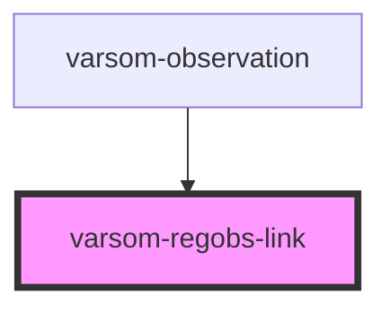

# varsom-avalanche-eval-problem

<!-- Auto Generated Below -->

## Properties

| Property | Attribute | Description | Type     | Default     |
| -------- | --------- | ----------- | -------- | ----------- |
| `regId`  | `reg-id`  |             | `number` | `undefined` |

## Dependencies

### Used by

 - [varsom-observation](../varsom-observation)

### Graph

----------------------------------------------

*Built with [StencilJS](https://stenciljs.com/)*
