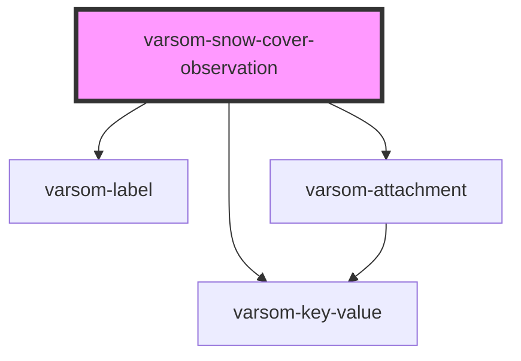

# varsom-water-level2

<!-- Auto Generated Below -->

## Properties

| Property                | Attribute                 | Description | Type           | Default     |
| ----------------------- | ------------------------- | ----------- | -------------- | ----------- |
| `Attachments`           | --                        |             | `Attachment[]` | `undefined` |
| `Comment`               | `comment`                 |             | `string`       | `undefined` |
| `CriticalLayerExists`   | `critical-layer-exists`   |             | `boolean`      | `undefined` |
| `CriticalLayerLocation` | `critical-layer-location` |             | `number`       | `undefined` |
| `CriticalLayerName`     | `critical-layer-name`     |             | `string`       | `undefined` |
| `CriticalLayerTID`      | `critical-layer-t-i-d`    |             | `number`       | `undefined` |
| `DepthHoarThickness`    | `depth-hoar-thickness`    |             | `number`       | `undefined` |
| `SnowPilotRef`          | `snow-pilot-ref`          |             | `string`       | `undefined` |
| `shortVersion`          | `short-version`           |             | `string`       | `undefined` |

## Dependencies

### Depends on

- [varsom-label](../varsom-label)
- [varsom-key-value](../varsom-key-value)
- [varsom-attachment](../varsom-attachment)

### Graph

----------------------------------------------

*Built with [StencilJS](https://stenciljs.com/)*
