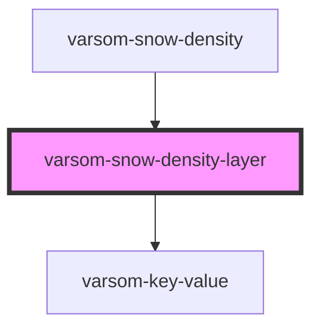

# varsom-snow-surface

<!-- Auto Generated Below -->

## Properties

| Property          | Attribute          | Description | Type  | Default     |
| ----------------- | ------------------ | ----------- | ----- | ----------- |
| `Depth`           | `depth`            |             | `any` | `undefined` |
| `SortOrder`       | `sort-order`       |             | `any` | `undefined` |
| `Thickness`       | `thickness`        |             | `any` | `undefined` |
| `WaterEquivalent` | `water-equivalent` |             | `any` | `undefined` |
| `Weight`          | `weight`           |             | `any` | `undefined` |
| `shortVersion`    | `short-version`    |             | `any` | `undefined` |

## Dependencies

### Used by

 - [varsom-snow-density](../varsom-snow-density)

### Depends on

- [varsom-key-value](../varsom-key-value)

### Graph

----------------------------------------------

*Built with [StencilJS](https://stenciljs.com/)*
