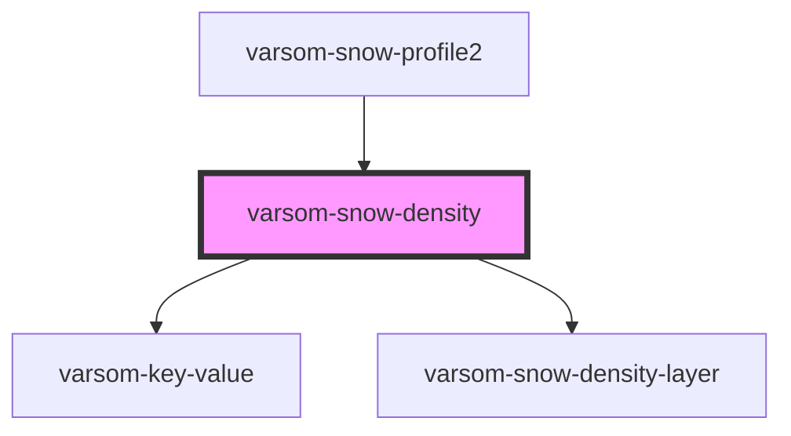

# varsom-snow-surface

<!-- Auto Generated Below -->

## Properties

| Property           | Attribute           | Description | Type                 | Default     |
| ------------------ | ------------------- | ----------- | -------------------- | ----------- |
| `Attachments`      | --                  |             | `Attachment[]`       | `undefined` |
| `Comment`          | `comment`           |             | `string`             | `undefined` |
| `CylinderDiameter` | `cylinder-diameter` |             | `number`             | `undefined` |
| `Density`          | `density`           |             | `number`             | `undefined` |
| `Depth`            | `depth`             |             | `number`             | `undefined` |
| `Layers`           | --                  |             | `SnowDensityLayer[]` | `undefined` |
| `TareWeight`       | `tare-weight`       |             | `number`             | `undefined` |
| `Weight`           | `weight`            |             | `number`             | `undefined` |
| `shortVersion`     | `short-version`     |             | `string`             | `undefined` |

## Dependencies

### Used by

 - [varsom-snow-profile2](../varsom-snow-profile2)

### Depends on

- [varsom-key-value](../varsom-key-value)
- [varsom-snow-density-layer](../varsom-snow-density-layer)

### Graph

----------------------------------------------

*Built with [StencilJS](https://stenciljs.com/)*
