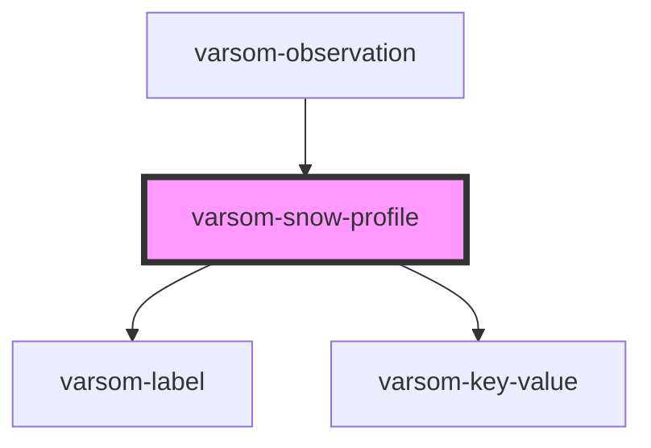

# varsom-snow-surface

<!-- Auto Generated Below -->

## Properties

| Property           | Attribute            | Description | Type           | Default     |
| ------------------ | -------------------- | ----------- | -------------- | ----------- |
| `Aspect`           | `aspect`             |             | `any`          | `undefined` |
| `Attachments`      | --                   |             | `Attachment[]` | `undefined` |
| `Comment`          | `comment`            |             | `any`          | `undefined` |
| `Copyright`        | `copyright`          |             | `any`          | `undefined` |
| `GeoHazardName`    | `geo-hazard-name`    |             | `any`          | `undefined` |
| `GeoHazardTID`     | `geo-hazard-t-i-d`   |             | `any`          | `undefined` |
| `Photographer`     | `photographer`       |             | `any`          | `undefined` |
| `RegistrationName` | `registration-name`  |             | `any`          | `undefined` |
| `RegistrationTID`  | `registration-t-i-d` |             | `any`          | `undefined` |
| `Url`              | `url`                |             | `any`          | `undefined` |
| `shortVersion`     | `short-version`      |             | `any`          | `undefined` |
| `strings`          | `strings`            |             | `any`          | `undefined` |

## Dependencies

### Used by

 - [varsom-observation](../varsom-observation)

### Depends on

- [varsom-label](../varsom-label)
- [varsom-key-value](../varsom-key-value)

### Graph

----------------------------------------------

*Built with [StencilJS](https://stenciljs.com/)*
