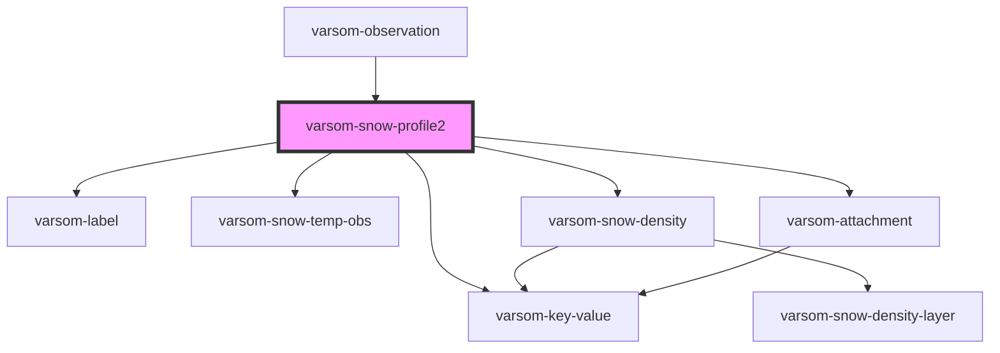

# varsom-snow-surface

<!-- Auto Generated Below -->

## Properties

| Property            | Attribute              | Description | Type                                                                               | Default     |
| ------------------- | ---------------------- | ----------- | ---------------------------------------------------------------------------------- | ----------- |
| `Attachments`       | --                     |             | `Attachment[]`                                                                     | `undefined` |
| `Comment`           | `comment`              |             | `string`                                                                           | `undefined` |
| `Exposition`        | `exposition`           |             | `number`                                                                           | `undefined` |
| `ImageUrl`          | `image-url`            |             | `string`                                                                           | `undefined` |
| `IsProfileToGround` | `is-profile-to-ground` |             | `boolean`                                                                          | `undefined` |
| `RegId`             | `reg-id`               |             | `number`                                                                           | `undefined` |
| `SlopeAngle`        | `slope-angle`          |             | `number`                                                                           | `undefined` |
| `SnowDensity`       | --                     |             | `SnowDensity[]`                                                                    | `undefined` |
| `SnowTemp`          | --                     |             | `{ Layers: SnowTempObs[]; Attachments?: Attachment[]; }`                           | `undefined` |
| `StratProfile`      | --                     |             | `{ TotalDepth: number; Layers: StratProfileLayer[]; Attachments?: Attachment[]; }` | `undefined` |
| `TotalDepth`        | `total-depth`          |             | `number`                                                                           | `undefined` |
| `Weight`            | `weight`               |             | `number`                                                                           | `undefined` |
| `shortVersion`      | `short-version`        |             | `string`                                                                           | `undefined` |

## Dependencies

### Used by

 - [varsom-observation](../varsom-observation)

### Depends on

- [varsom-label](../varsom-label)
- [varsom-key-value](../varsom-key-value)
- [varsom-snow-temp-obs](../varsom-snow-temp-obs)
- [varsom-snow-density](../varsom-snow-density)
- [varsom-attachment](../varsom-attachment)

### Graph

----------------------------------------------

*Built with [StencilJS](https://stenciljs.com/)*
